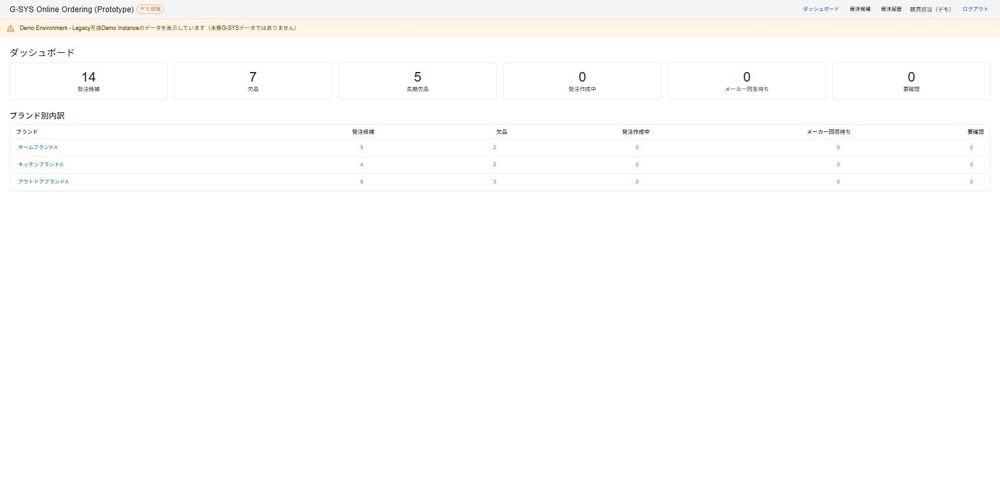
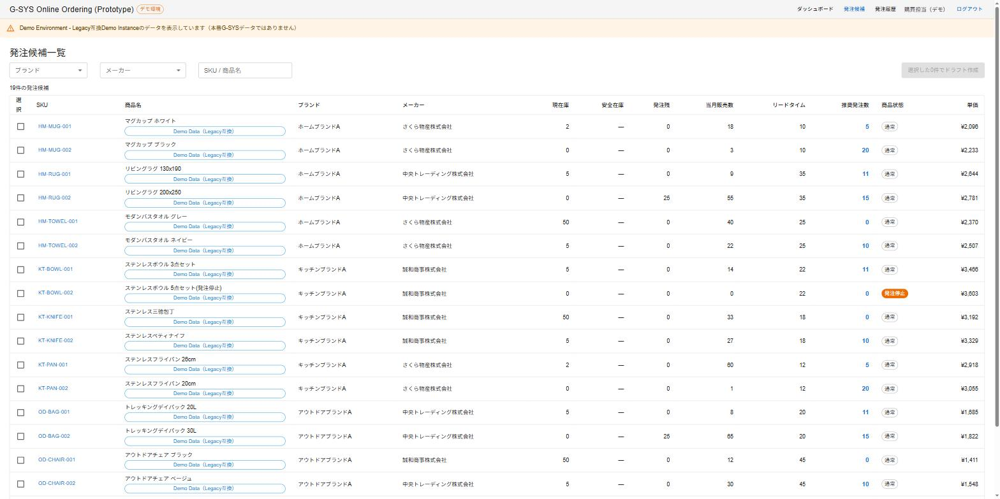
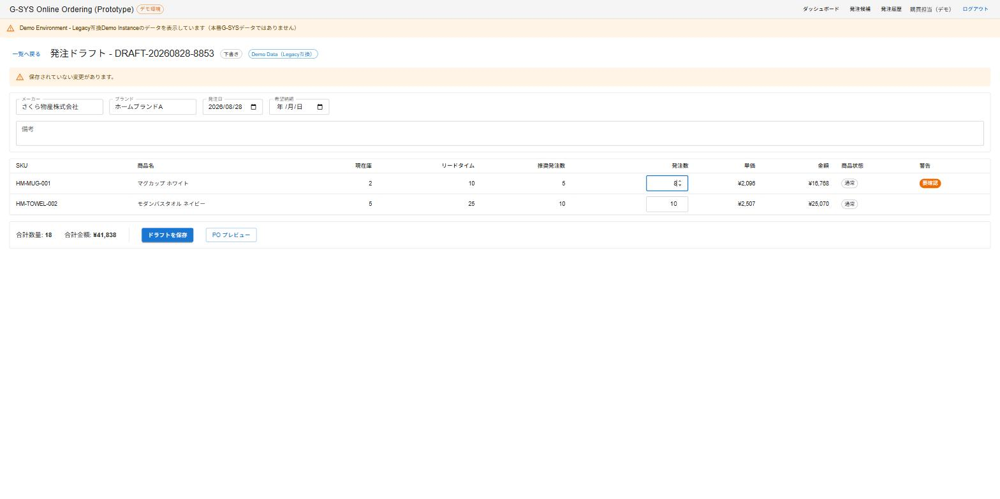
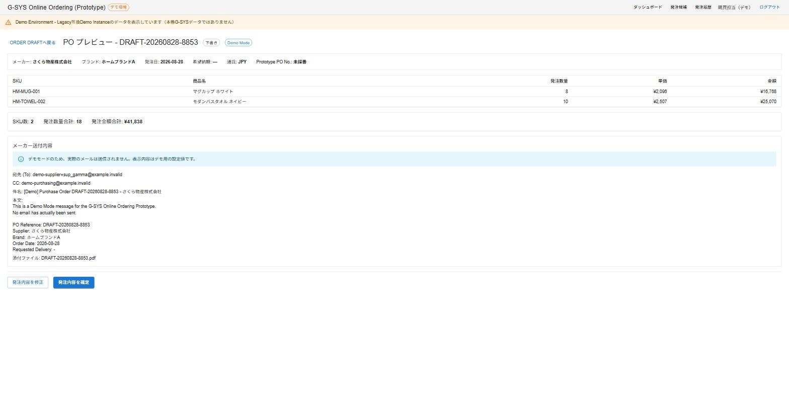
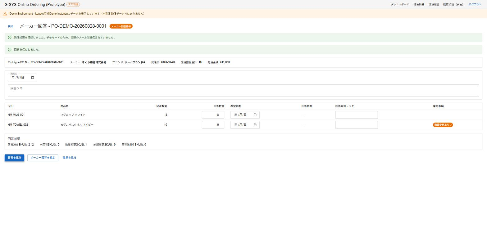
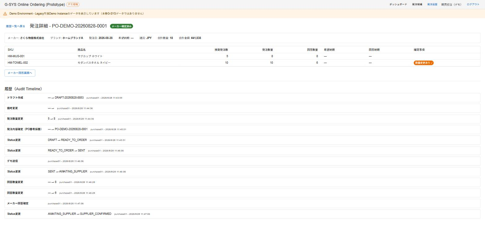

# G-SYS Online Ordering Prototype ウォークスルー

このウォークスルーは、9/17デモ台本ではなく、システムの全体像を理解するための資料である。

## 業務フロー

```
発注候補
  ↓
Draft
  ↓
PO Preview
  ↓
発注確定
  ↓
Demo Send
  ↓
メーカー回答
  ↓
履歴
```

**G-SYSにある在庫・販売・発注残等をもとにRecommended Qtyを提示し、人が発注数量を判断し、メーカー回答まで一連で管理するPortal。**

---

## 1. Dashboard



### この画面は何か

ログイン後、最初に表示される画面。今、対応すべきことが何件あるかを一目で把握する入口。Sales Trendや粗利といったAnalyticsの画面ではなく、あくまで今日の作業起点（Action / Operation Cockpit）である。

### ここで見るもの

- 発注候補：Recommended Qty > 0のSKU件数
- 欠品／長期欠品：在庫切れの件数
- 発注作成中：Draft作成済みでまだ確定していない件数
- メーカー回答待ち：メーカーへ送信済みで回答待ちの件数
- 要確認：Acknowledge待ちのAttention件数
- ブランド別内訳：上記をBrand単位で分解した表

### 次に何をするか

「発注候補」タイルまたはブランド行をクリックし、Order Candidate Listへ進む。

---

## 2. Order Candidate List（発注候補一覧）



### この画面は何か

Legacy G-SYSの在庫・販売実績・発注残の情報と、既存の発注判断Formulaを使って、「何をどれだけ発注すべきか」を一覧で見る画面。

### ここで見るもの

- 商品名・Brand・Supplier
- 現在庫・安全在庫・発注残
- 当月販売数・Lead Time
- 推奨発注数（Recommended Qty）：0件のSKUと算出されているSKUが混在していることが分かる

### 次に何をするか

発注したいSKUをチェックボックスで選択し、「ドラフト作成」でOrder Draftへ進む。

---

## 3. Order Draft（発注ドラフト）



### この画面は何か

システムが数量を決定するのではなく、Recommended Qtyを参考にしながら、人が最終的な発注数量を判断・入力する画面。

### ここで見るもの

- 推奨発注数（Recommended Qty）と発注数（Order Qty）の並び
- 推奨値から大きく外れた場合に表示される「要確認」警告
- SKUごとの単価・金額、合計数量・合計金額
- 「ドラフトを保存」で何度でも編集・再保存できること

### 次に何をするか

内容を確定させたら「PO プレビュー」でPO Previewへ進む。

---

## 4. PO Preview（PO プレビュー）



### この画面は何か

メーカーへ発注する直前の最終確認画面。Draftの内容を確認用に表示するだけで、ここから数量を直接編集することはできない。

### ここで見るもの

- SKUごとの発注数量・単価・金額
- 発注数量合計・発注金額合計
- メーカーへの送付内容（宛先・件名・本文）のプレビュー
- 「デモモードのため、実際のメールは送信されません」という注記

### 次に何をするか

「発注内容を確定」でPO番号を採番し、続けて「メーカーへ送信」（Demo Send）を行うとSupplier Response画面へ進む。

---

## 5. Supplier Response（メーカー回答）



### この画面は何か

発注して終わりではなく、メーカーから実際に何個・いつ納品できるかという回答を記録し、発注内容との差異を管理する画面。

### ここで見るもの

- SKUごとの発注数量と回答数量の並び
- 回答数量が発注数量と一致するSKU（差異なし）と、異なるSKU（「数量変更あり」の確認事項が表示される）
- 回答日・回答メモ
- 「回答を保存」は何度でも可能、全SKU回答後に「メーカー回答を確定」できること

### 次に何をするか

「メーカー回答を確定」後、「履歴を見る」で発注履歴（History）へ進む。

---

## 6. Order History / Timeline（発注履歴）



### この画面は何か

「推奨 → 人の判断 → メーカー回答」という数量の変化と、「誰が・いつ・何をしたか」を後から追跡できる画面。

### ここで見るもの

- SKUごとの推奨発注数・発注数量・回答数量の3段階の並び
- 差異があるSKUに表示される確認事項（Attention）
- 画面下部のAudit Timeline：ドラフト作成から発注確定・Demo Send・メーカー回答確定まで、実行者・実行時刻付きで記録された一連の操作履歴

### 次に何をするか

これでCore Workflow一巡は完了。Dashboardに戻ると、「要確認」件数などがこの発注の状態を反映していることが確認できる。
