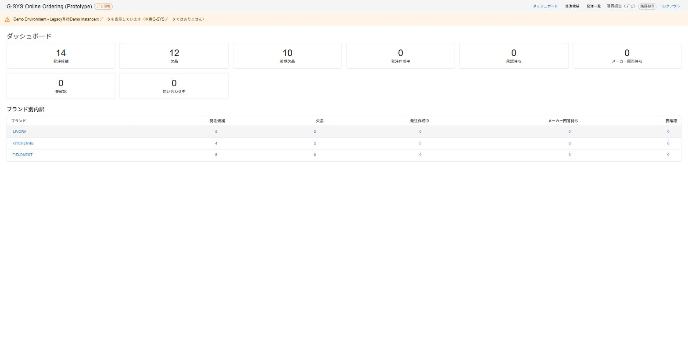
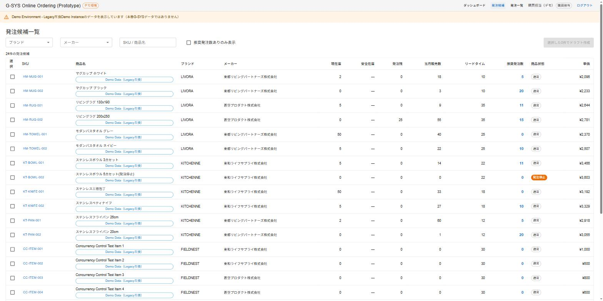
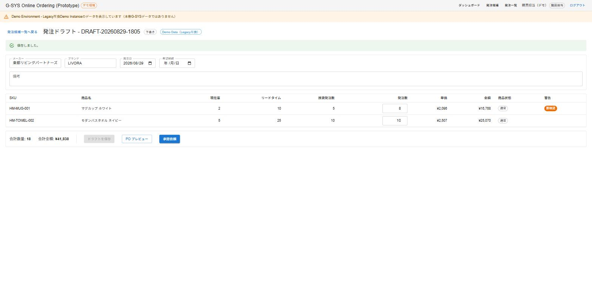
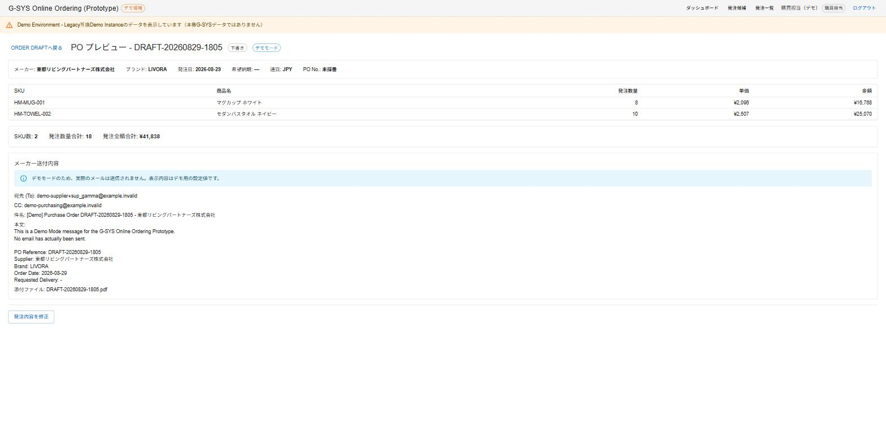
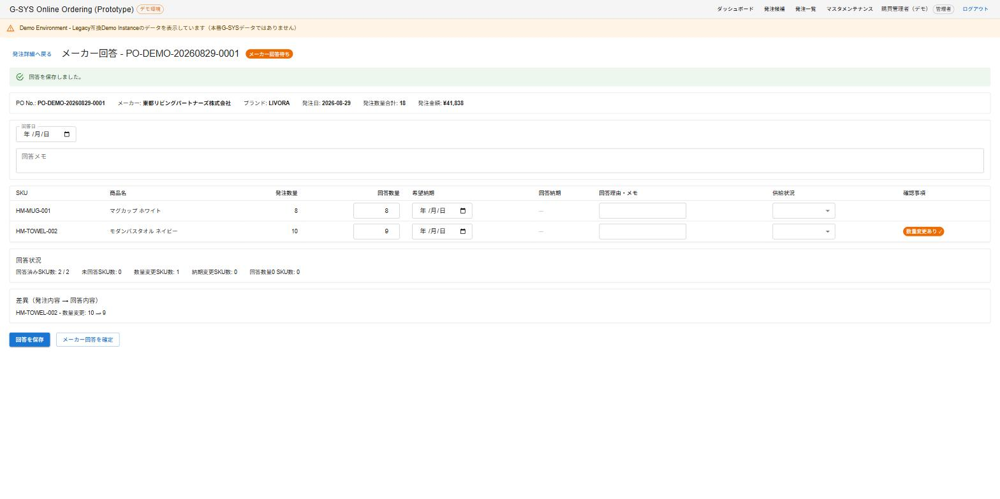
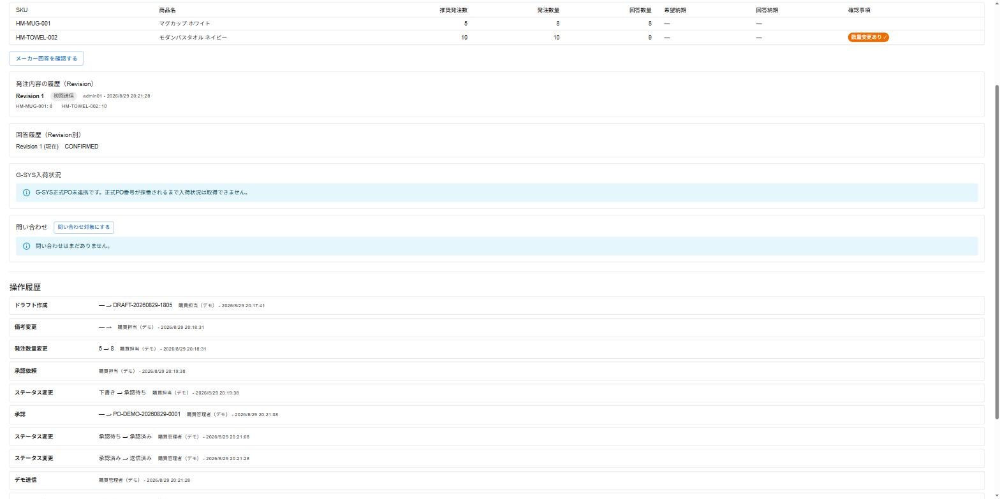

# G-SYS Online Ordering Prototype Walkthrough

This walkthrough is not the 9/17 customer demo script (`docs/9-17-demo-script.md`) - it's a reference for understanding what the system does and how it works, screen by screen.

**Revision history**: This document was fully revised in Phase 7-E. The original version predated the Approval Workflow, Revision/Agreement, Supplier Contact/Mail Template, Official PO Integration, Fulfillment, Follow-up, and Legacy PO Concurrency Foundation, and referenced a "Confirm Order" button and a "Ready to Order" Status that were both removed by Phase 7-C1's V8 migration and no longer exist in the current screens. Screenshots (01-06) have been retaken against the current UI.

## Business Flow

```
Order Candidates
  ↓
Draft
  ↓
PO Preview
  ↓
Approval (OPERATOR submits -> ADMIN approves)
  ↓
Demo Send
  ↓
Supplier Response
  ↓
Attention / Revision & Agreement
  ↓
History
```

**A Portal that takes the stock, sales, and open-PO data already in G-SYS, proposes a Recommended Qty, lets a person decide the actual order quantity, routes it through a manager's approval, and tracks the process all the way through to the supplier's response and any resulting differences.**

---

## 1. Dashboard



### What this screen is

The first screen after login. It's the entry point for seeing, at a glance, how many things need attention right now. This is not a Sales Trend or margin-analysis Analytics screen - it's today's action starting point (an Action / Operation Cockpit).

### What to look at

- Order Candidates: number of SKUs with a Recommended Qty greater than zero
- Out of Stock / Long-term Out of Stock: number of SKUs currently judged Out of Stock / Long-term Out of Stock by the Prototype's provisional logic (the official definition is still pending confirmation of Gulliver's current business operation - see `docs/9-17-demo-script.md` section 21)
- Drafts in Progress: Drafts created but not yet submitted for approval
- Pending Approval: waiting on an ADMIN's approval
- Awaiting Supplier Response: orders sent to the supplier and waiting on an answer
- Needs Attention: number of Attentions still waiting to be acknowledged
- Open Follow-up Cases: follow-up inquiries still waiting to be closed
- Brand breakdown table: the same counts broken down by Brand

### What happens next

Click the "Order Candidates" tile or a Brand row to go to the Order Candidate List.

---

## 2. Order Candidate List



### What this screen is

Uses the stock, sales history, and open-PO data from Legacy G-SYS together with the existing ordering Formula to show, in one list, "what should we order, and how much."

### What to look at

- Item name, Brand, Supplier
- Current Stock, Safety Stock, Open PO
- This month's sales, Lead Time
- Recommended Qty: notice that both SKUs with a Recommended Qty of 0 and SKUs with a positive Recommended Qty appear together in the same list
- Item Status (Normal/Discontinued/On Hold etc.) and Stock Judgement (provisional) (Normal/Out of Stock/Long-Term Out of Stock): two independent pieces of information in separate columns/Badges - Item Status comes from the Legacy Item Master, while Stock Judgement is provisionally calculated from Current Stock and Open PO. A SKU with Item Status = Normal can still show Stock Judgement = Long-Term Out of Stock; that is not a contradiction. Rows reached via the Dashboard's "Out of Stock"/"Long-term Out of Stock" tile or Brand row show this same Badge. The official definition for Stock Judgement remains pending Customer Review, per `docs/9-17-demo-script.md` section 21.

### What happens next

Select the SKUs you want to order using the checkboxes, then click "Create Draft" to move to the Order Draft screen (mixing SKUs from different suppliers in one selection is not allowed).

---

## 3. Order Draft



### What this screen is

The system doesn't decide the final quantity - a person does, using the Recommended Qty as a reference point. This screen is where that human judgment call actually happens.

### What to look at

- Recommended Qty sitting next to Order Qty
- A "Needs Attention" warning that appears when the entered quantity deviates significantly from the recommendation
- Unit price and line amount per SKU, plus total quantity and total amount
- "Save Draft" can be used to save and re-edit as many times as needed

### What happens next

Once the content is ready, click "PO Preview" to move to the PO Preview screen, or submit directly for approval to move into the Approval Workflow (next section).

---

## 4. PO Preview



### What this screen is

The final check before the order actually goes to the supplier. It's a read-only display of the Draft's content - quantities cannot be edited directly from this screen.

### What to look at

- Order quantity, unit price, and amount per SKU
- Total order quantity and total order amount
- A preview of what would be sent to the supplier (recipient, subject, body) - this is a fixed Demo value, distinct from the real "Mail Preview" feature (section 9) that resolves actual Supplier Contact / Mail Template Master data
- The note confirming "this is Demo Mode - no email is actually sent"

### What happens next

"Edit Order" returns to the Order Draft screen, or submit for approval from the Draft screen to move into the Approval Workflow. **The "Send to Supplier" button does not appear on this screen until the order has actually been approved (Status = Approved).**

---

## 5. Approval Workflow (OPERATOR submits -> ADMIN approves / edits-and-approves / returns)

### What this screen is

The manager (ADMIN) reviewing and approving what the requester (OPERATOR) drafted - a role split this Portal introduces, since no equivalent exists in the current G-SYS.

### What to look at

- The OPERATOR clicking "Submit for Approval" moves the Status to "Pending Approval," after which even the requester can no longer edit the order quantities
- From the Order Detail screen, the ADMIN can Approve, Edit-and-Approve (correct the content in place before approving), or Return (a reason is required)
- Approving assigns a Prototype PO No. (`PO-DEMO-YYYYMMDD-####`) and moves the Status to "Approved"
- If returned, the OPERATOR sees the return reason directly on their screen and can resubmit after fixing it

### What happens next

Open the now-Approved order in PO Preview and click "Send to Supplier" (Demo Send).

---

## 6. Supplier Response



### What this screen is

Placing the order isn't the end of the process - this screen records what the supplier actually confirms they can deliver (quantity and date), and tracks any difference from what was ordered. Entering, saving, and confirming the response is done by the OPERATOR, same as Draft creation and submission - it's the act of recording a fact the supplier reported, distinct from deciding how to handle any resulting difference.

### What to look at

- Ordered quantity sitting next to confirmed quantity, per SKU
- SKUs where the confirmed quantity matches the ordered quantity (no difference) versus SKUs where it differs (flagged with a "Quantity Changed" Attention)
- Response date and response notes
- "Save Response" can be used any number of times; "Confirm Response" becomes available only once every SKU's answer has actually been **saved** (not just typed)

### What happens next

After "Confirm Response," if there's a difference, an ADMIN chooses either "Agree" (accept the response as-is) or "Create Revision" (send the order back to Draft). If there's no difference, move straight on to History.

---

## 7. Attention and Revision / Agreement

### What this screen is

Surfaces quantity/delivery differences from the supplier's response as an "Attention," lets a user acknowledge them, and lets an ADMIN either agree to the difference as-is or create a corrected Revision. Deciding how to handle the difference the OPERATOR just recorded is the ADMIN's role - both Agreement and Revision creation are ADMIN-only actions.

### What to look at

- Quantity/delivery-change Attentions stay ACTIVE until a user explicitly acknowledges them (unlike the Partial-response Attention, which auto-resolves)
- An ADMIN clicking "Agree" accepts the response with the difference intact (Status = Agreed); "Reopen Agreement" reverts it, with a required reason
- "Create Revision" sends the order back to an editable Draft, so the same Draft -> Approve -> Send -> Supplier Response cycle can run again
- The Order Detail screen's Revision History and per-Revision Response History sections show that every past Revision and response is preserved, never deleted

### What happens next

Check the History screen's Audit Timeline to see the full, cross-Revision sequence of operations.

---

## 8. Master Maintenance (Supplier Contacts / Mail Templates)

### What this screen is

ADMIN-only screens. Since the current G-SYS has no Master for supplier contact names, email addresses, or mail wording, these are new Portal-only Masters, reached via "Master Maintenance" in the top-right of the header.

### What to look at

- Supplier Contact management: register a supplier code, an optional brand code, a contact name, an email address, a type (To/CC), a language, etc.
- Mail Template management: register subject/body text per template type, per supplier/brand condition, per language
- Neither Master is ever written back to Legacy - both live entirely inside the Portal

### What happens next

Open an Order Detail screen's "Mail Preview" to see how the registered data actually resolves.

---

## 9. G-SYS Integration, Fulfillment, and Follow-up (extended features)

### What this screen is

A set of G-SYS integration/reconciliation features that progressively appear on an Approved-or-later order's Detail screen.

### What to look at

- **Mail Preview**: resolves the actual Supplier Contact Master / Mail Template to build a real To/CC, subject, and body (no real send). Subject/body don't render yet, since the Official PO No. numbering rule is still awaiting customer agreement.
- **Official PO Integration (Preflight)**: checks whether the supplier/brand/item codes are consistent with the G-SYS Master (PASS/WARNING/BLOCKED). No actual file handoff or registration into G-SYS happens.
- **G-SYS Fulfillment status**: once an Official PO No. is linked, shows Ordered/Invoiced/Stock-in/Outstanding quantities.
- **Follow-up**: create a follow-up case for an outstanding/partially-delivered SKU, preview its mail wording, close it, or spin up a reorder Draft from it.
- **G-SYS reconciliation (Legacy PO Concurrency)**: captures the current G-SYS state as a baseline and shows a diff if it later changes.

### What happens next

Some of these require Demo-environment-only setup (a manually linked test Official PO No.) beforehand - see `docs/9-17-demo-script.md` for details.

---

## 10. Order History / Timeline



### What this screen is

Lets you trace, after the fact, both the quantity's journey - "Recommended → Human decision → Supplier's answer" - and exactly who did what, and when.

### What to look at

- The three-stage comparison per SKU: Recommended Qty, Ordered Qty, Confirmed Qty
- The Attention flags shown on any SKU with a difference
- The "Activity History" section at the bottom: every step from Draft creation through submission, approval, Demo Send, Supplier Response confirmation, Agreement, and Revision creation, each recorded with who performed it and when

### What happens next

This completes one full pass through the Core Workflow. Going back to the Dashboard, you'll see the "Needs Attention" count and related figures now reflect this order's state.
