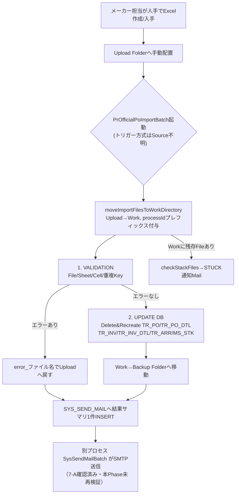
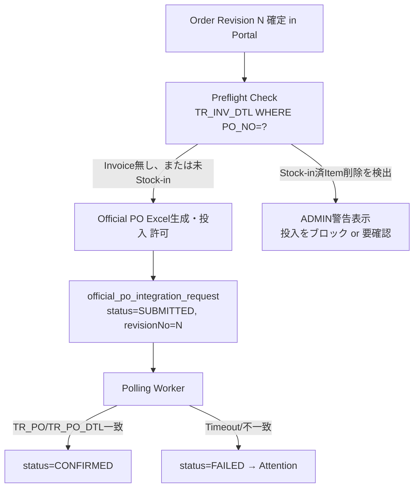
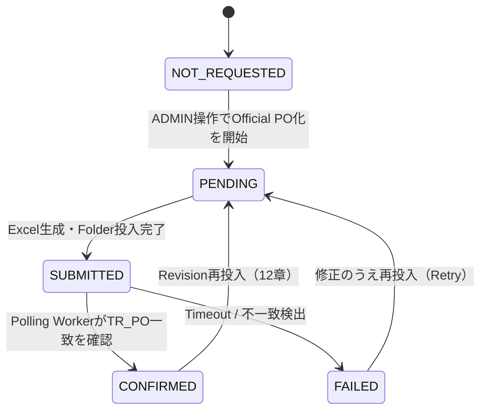
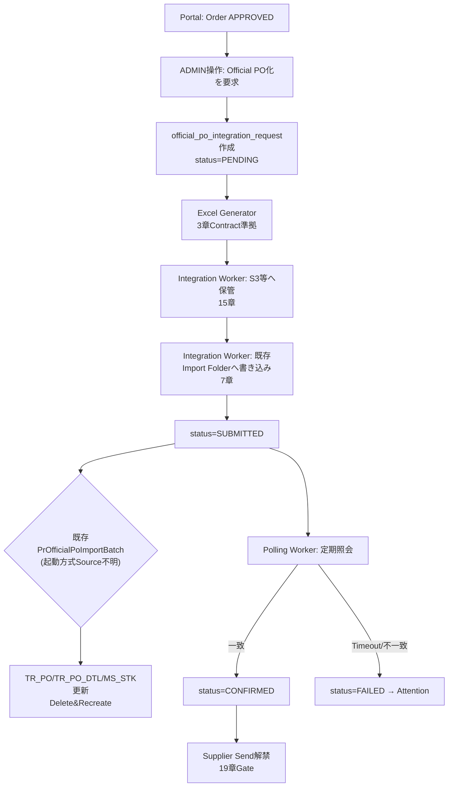

# Official PO Integration Detailed Design（Phase 7-C2-Design）

Docs-only Phase。実装・DB Migration・Legacy変更は一切行っていない。すべての事実はSource（`phasep-gulliver/gulliver`, `backend/`）を直接読んで確認したもので、Sourceから確認できない部分は明示的に「Source不明」と記載する（推測での穴埋めはしない）。

このPhaseの目的：Portalで `APPROVED` になったOrderを、現行G-SYSのOfficial POとして安全に正式化するIntegration方式を、Source Codeベースで詳細設計する。

---

## 1. Executive Summary

- 現行G-SYSのOfficial PO確定は、**`PrOfficialPoImportBatch`（standalone Spring Boot CommandLineRunner）が特定Folderに置かれたExcelファイルを読み、TR_PO/TR_PO_DTL/TR_INV/TR_INV_DTL/TR_ARR/MS_STKをJDBC Transaction内で書き換える一括処理**である。Web APIではない。
- Official PO Importは**常にDelete & Recreate**（既存POがあれば全DTL/関連Invoiceを削除してから新規作成）。Revisionという概念はSourceに存在しない。
- **Currencyは値ではなくExcel Cellの表示形式（Number Format文字列）から判定される**（`AbstImportBatch.getCcyCode`, `phasep-gulliver/gulliver/src/main/java/jp/ne/glv/batch/core/AbstImportBatch.java:1087`）。Portal側でExcelを生成する場合、この点を誤ると全行がCurrency不明エラーになる。
- Import Folder・Trigger（cron/Task Scheduler等）の実体は**Source上に一切存在しない**（`MS_COMM`という実行時DBデータと、OS側のスケジューラ設定に依存）。したがってFolder Path・起動方式はSourceからは確定できず、CUSTOMER REVIEW送り。
- Phase 7-C1の `prototypePoNo`（`PO-DEMO-yyyyMMdd-####`）は **G-SYS Official PO No.とは完全に無関係な、Portal内部限定の識別子**であることをSourceベースで再確認した（1章）。
- 推奨Integration方式は、Phase 7-B同様に**方式A：Excel Import Pipelineへの投入（現行Importの型式に完全準拠したExcelをPortalが生成し、既存Folderへ置く）**。理由は22章のDecision Matrixに記載。
- 7-C2の実装は「投入」だけでなく「**投入結果の確認（Success/Failure Detection）**」までを1セットとして設計しないと、Portal側のWorkflow Statusが宙に浮く。19章のGate設計を参照。

---

## 2. Current Official PO Import Flow

### 2.1 起動単位

`PrOfficialPoImportBatch`（`phasep-gulliver/gulliver/src/main/java/jp/ne/glv/batch/PrOfficialPoImportBatch.java`）は `AbstImportBatch`（`.../batch/core/AbstImportBatch.java`）を継承し、さらに `AbstBatch`（`.../batch/core/AbstBatch.java`）を継承する。

- `AbstBatch.executeRun()`（`AbstBatch.java:56`）が `SpringApplication` を **`setWebEnvironment(false)`** で起動する（`AbstBatch.java:58`）。つまりWebサーバではなく、**1回実行して終了するCLIプロセス**。
- `PrOfficialPoImportBatch.main()`（`PrOfficialPoImportBatch.java:189`）が `executeRun(PrOfficialPoImportBatch.class, args)` を呼ぶだけ。
- `batch_pom_PrOfficialPoImportBatch.xml` は他バッチと同じく専用の `pom.xml`（Maven module定義）で、`create_package.bat` がこれを `pom.xml` にコピーして `mvn package` するビルド手順のみを示す（実行トリガーは含まれない）。

### 2.2 実行フロー（`AbstImportBatch.run()`, `AbstImportBatch.java:119-166`）

```
1. initialize()                         — 各種ホルダ初期化、processId(yyyyMMddHHmmss)発行
2. execute(args)                        — サブクラス実装。バリデーション→DB更新
3. createBackUpAndErrorFile()           — 成功File→backup、失敗File→upload(error prefix)へ戻す
4. sendMailNotice() / sendMail()        — SYS_SEND_MAILへ結果サマリを1件INSERT
5. checkStackFiles()                    — workフォルダの取り残しFileがあれば別途Mail
例外時: printStackTrace → sendExceptionEmail（JavaMailSenderで即時SMTP送信）→ BatchException再送出
```

`execute()` は `@Transactional(rollbackFor = BatchException.class)`（`AbstImportBatch.java:120`）で1メソッド全体が単一Transaction。**ファイル単位ではなく、バッチ実行単位でTransactionが切られている**（正確には、`entityManager.flush()/clear()`が随所で呼ばれているため中間コミットではなくJPA永続コンテキストのクリアであり、DBトランザクション自体は最後までロールバック可能な状態を保つ設計）。

### 2.3 `PrOfficialPoImportBatch.execute()` の内部フロー

```
1. VALIDATION（PrOfficialPoImportBatch.java:248-830）
   ファイル単位でループ:
   1.1 File Format/Size検証
   1.2 Sheet Header文字列検証（"PURCHASE" "ORDER TO" "PURCHASER" "No" "CntryOrg1" "Box height[cm]" 等）
   1.3 Cell値検証（PO No.形式・Supplier/Brand Master整合・Qty/Price数値性・Currency単一性・
       既存Invoice/Stock-inとの整合 等）
   1.4 重複Key検証（checkDuplicateKey）
2. UPDATE DB（PrOfficialPoImportBatch.java:835-1215）
   エラーの無いFileのみ:
   2.1 既存TR_PO/TR_PO_DTLがあれば全削除（対応TR_INV_DTL/TR_INVも削除）— Delete
   2.2 TR_PO/TR_PO_DTL新規作成 — Recreate
   2.3 Invoice列があればTR_INV/TR_INV_DTL作成/更新
   2.4 TR_ARR再構築（businessLogicUtil.refreshTrArr）
   2.5 MS_STK再構築（refreshMsStkTransactions, refreshMsStkShipQtyTransactions）
```

### Mermaid: Current Official PO Import Flow



---

## 3. Excel Contract

**Source of Truth = `PrOfficialPoImportBatch.java` の `ROW_IDX_*`/`COL_IDX_*` 定数（0-based）**。`phasep-gulliver/gulliver/testfile/OfficialPO.xlsx` を実際にパースし突き合わせ確認済み（3.3節）。

### 3.1 Sheet構造

- 単一Sheet（`wk.getSheetAt(0)`）。Sheet名自体は検証されない（`sheetName`はエラーメッセージ用途のみ）。
- Header文字列検証（一致しないと即 `INVALID FILE FORMAT` でFile全体スキップ）:

| 0-based Row | 0-based Col | 期待文字列 | Source |
|---|---|---|---|
| 1 | 8 | `PURCHASE`（部分一致） | PrOfficialPoImportBatch.java:280-285 |
| 6 | 7 | `ORDER TO`（部分一致） | :286-290 |
| 13 | 1 | `PURCHASER`（部分一致） | :297-301 |
| 16 | 1 | `No`（部分一致） | :302-306 |
| 16 | 11 | `CntryOrg1`（部分一致） | :313-317 |
| 16 | 12 | `Box height[cm]`（部分一致） | :319-323 |
| 16 | 13 | `Box width[cm]`（部分一致） | :325-329 |
| 16 | 14 | `Box depth[cm]`（部分一致） | :331-335 |
| 16 | 15 | `Weight[kg]`（部分一致） | :337-341 |

### 3.2 Header領域（Order単位・PO 1件につき固定Cell）

| Field | 0-based Row,Col | 型/Format | Required | Max Length (Const) | 備考 |
|---|---|---|---|---|---|
| Order Date | 2,9 | Excel Date | Yes | — | `"init"`を含むと**Official Import失敗**（`ordrDateStr.toLowerCase().contains("init")`, :352-355）。Initial POとの識別Key（4章）。 |
| **PO No.** | 3,9 | 文字列 | Yes | 30（`Const.LEN_TR_PO_PO_NO`） | 5章で詳述。TR_PO.PO_NOの主キー値そのもの。 |
| Delete Flag | 2,10 | 文字列 `"DELETE"` | No | — | `Const.KEY_DELETE`と一致すると当該PO Noを削除のみ（新規作成しない）。 |
| Brand Name | 4,9 | 文字列 | Yes | — | PO No.から逆算したBrand CdのMsComm名称と**大文字小文字を無視して一致必須**（`equalsIgnoreCase`, :418）。不一致は`BRAND CODE IN PO# IS INVALID`。 |
| Delivery Week | 14,3 | 文字列（例 `"WK36"`） | Yes | 5（`LEN_TR_PO_DELIV_WEEK`） | Initial POでは**逆にこの列自体が禁則**（4章）。 |
| Delivery Date | 14,4 | 文字列 | Yes | 50（`LEN_TR_PO_DELIV_DATE`） | Initial POでは**空でなければエラー**（4章）。 |
| Ship VIA | 14,6 | 文字列 | No | 100（`LEN_TR_PO_SHIP_VIA`） | |
| Ship Term | 14,8 | 文字列 | No | 100（`LEN_TR_PO_SHIP_TERM`） | |
| Payment Term | 14,10 | 文字列 | No | 100（`LEN_TR_PO_PAYMENT_TERM`） | |
| Invoice No. | 16固定行, 可変列(17以降) | 文字列（`INV-`/`INV`prefix除去） | No | — | 存在すればTR_INV/TR_INV_DTLも同時作成。8-16章の範囲外の高度な機能で、本Phaseの主眼（PO本体）とは切り離して評価すべき。 |

### 3.3 明細行（Item単位・17行目以降、Item Code列が空になるまで、または `TOTAL` セルで終了）

実測（`testfile/OfficialPO.xlsx` を本Phaseでpythonでunzip/XML解析し実際のCell値を確認。ExcelはZIP+XML形式のため直接Sourceとして解析可能、バイナリを推測していない）:

| 0-based Col | Field | 型 | Required | Max Length | 実測サンプル値 |
|---|---|---|---|---|---|
| 2 | Item Code | 文字列 | Yes | — | `LCP-7501-000` |
| 3 | Series | 文字列 | No | 100 | `LE PLIAGE` |
| 4 | Model No. | 文字列 | No | 150 | `1699 089 001` |
| 5 | Model | 文字列 | No | 400 | `Sac A Dos` |
| 6 | Color | 文字列 | No | 100 | `Noir/Black` |
| 7 | Description | 文字列 | No | 200 | `Backpack` |
| 8 | **Order Qty** | 数値 | Yes | Integer上限 | `15` |
| 9 | **Unit Price** | 数値（Cell値）＋**Cell Number Format＝Currency** | Yes | 9,999,999,999.99未満 | `32.4` |
| 9 | PO Currency | ※Unit Priceと同一Cellの表示形式から導出 | Yes | — | 3.4節参照 |
| 10 | Amount | 数値（参考値、DB未保存） | No | — | `486` |
| 11 | Country of Origin | 文字列 | No | 300（`LEN_MS_ITEM_IMP_CTRY_ORG_1`） | MsItemへ書き戻し |
| 12 | Box Height[cm] | 数値 | No | 20 | MsItemへ書き戻し |
| 13 | Box Width[cm] | 数値 | No | 20 | MsItemへ書き戻し |
| 14 | Box Depth[cm] | 数値 | No | 20 | MsItemへ書き戻し |
| 15 | Add Note 9 (Weight[kg]) | 数値 | No | 100（`LEN_MS_ITEM_ADD_NOTE_9`） | MsItemへ書き戻し |

**G-SYS destination**: Item行はまず `MsItem`（Item Master, `msItemRepository.findMsItemByItemCd`）の存在確認（無ければ即エラー、通知先MsComm `M_OFF_PO2` へ追加Mail）。合格した行は `TrPoDtl`（PO明細, :1034-1051）へ、Country of Origin/Box寸法/重量は同じ行から`MsItem`へも書き戻される（:980-1003）。

### 3.4 Currencyの実体（見落としやすい重要事項）

`getCcyCode()`（`AbstImportBatch.java:1087-1098`）は、Cellの**値ではなく `Cell.getCellStyle().getDataFormatString()`（Excelの表示形式文字列）** をMS_COMM（`CATE_ID_MS_CCY`）の通貨記号Masterと突き合わせて判定する。値そのものはただの数値（例 `32.4`）であり、通貨は「そのCellがいくら通貨表示形式（`$#,##0.00`等）で書式設定されているか」で決まる。

**Portal側でExcelを生成する場合、Apache POI等で該当Cellに正しい `CellStyle`（通貨記号を含むDataFormat）を明示的に設定しないと、全行が `getCcyCode()==null` となり `INVALID CCY` エラーになる。** 単にCellへ文字列やプレーンな数値を書き込むだけでは成立しない。

---

## 4. Initial vs Official

Source比較（`PrInitialPoImportBatch.java` vs `PrOfficialPoImportBatch.java`、同一Row/Col定数構造）:

| 項目 | Initial PO | Official PO | Source |
|---|---|---|---|
| Order Date Cell (Row2,Col9) | `"init"`を**含まなければ**エラー（`THIS IS NOT A VALID INITIAL PO`） | `"init"`を**含めば**エラー（`THIS IS NOT A VALID OFFICIAL PO`） | PrInitialPoImportBatch.java:285 / PrOfficialPoImportBatch.java:352-355 |
| Delivery Date Cell | **空でなければ**エラー（`DELIVERY DATE IS NOT NEEDED IN INITIAL PO`） | 必須（空だとエラー） | PrInitialPoImportBatch.java:359-364 |
| Unit Price / PO Currency | Validation・DB書き込みとも**コメントアウトされ無効化**（TrPoDtl.setPrcUnit呼び出し自体が :696 でコメントアウト） | 必須・検証あり | PrInitialPoImportBatch.java:403-406,529-540,669-701 |
| 既存POとの関係 | 既存TR_POが `OFFICIAL` または `STOCKIN` の場合は**Import拒否**（`OFFICIAL PO IS ALREADY REGISTERED. INITIAL PO CAN NOT BE UPDATED.`） | 既存TR_POは無条件でDelete&Recreate | PrInitialPoImportBatch.java:306 |
| TR_PO.STATUS | `Const.TR_PO_STATUS_INITIAL`（`"INITIAL"`） | `Const.TR_PO_STATUS_OFFICIAL`（`"OFFICIAL"`） | PrInitialPoImportBatch.java:624 / PrOfficialPoImportBatch.java:937 |

### 4.1 PortalはInitial POを生成すべきか

**評価: 不要、と考える。** 根拠:

1. Initial→Officialは「同じPO Noの上書き」を前提にした運用（Initial PO ExcelでPO No.を仮に確保し、後日同じPO NoのOfficial PO Excelで正式化する）。Portalでは、DRAFT→PENDING_APPROVAL→APPROVEDというWorkflow自体がこの「仮登録→正式化」の役割を**Portal内部で完結して**代替している（Draft No./承認プロセス自体がInitial POの意味的代替）。
2. Initial POのSource上の主目的は「G-SYS側にPre-lock目的でPOのガワ（Item無し/価格無し）を先に登録しておく」ことだが、Portal側ではその「仮登録」はG-SYS DBに触れず、Portal DB内のOrder(DRAFT/PENDING_APPROVAL)として完結できる。G-SYS側にInitial POとして先に登録する実利は、7-Aの調査（既存業務フロー）でも明確な理由が確認できていない。
3. Initial PO専用のGate（`STATUS=OFFICIAL/STOCKIN`なら拒否）はPortal→G-SYSの一方向Integrationとは無関係な制約であり、複雑さを増すだけでPortal側の要件を満たさない。

結論案: **`APPROVED → G-SYS OFFICIAL`のみを実装し、Portal→G-SYS INITIALの投入は行わない。** ただし「Initial PO Excelを人手で先に投入する既存運用が今も生きているか」はSource外の実運用情報であり、20章のCUSTOMER REVIEWに残す。

---

## 5. PO Number Contract

### 5.1 Phase 7-C1 PO No.の正体（最重要確認事項）

Portal側 `PrototypePoNoGenerator`（`backend/src/main/java/com/glv/gsysportal/service/PrototypePoNoGenerator.java`）を再確認した：

- **採番Service**: `PrototypePoNoGenerator.generate()`
- **採番形式**: `PO-DEMO-<yyyyMMdd>-<4桁以上の連番>`（例 `PO-DEMO-20260827-0001`）
- **DB Column**: `portal_order.prototype_po_no VARCHAR(30)`、`prototype_po_no_seq`という**PostgreSQLシーケンス**から`nextval()`で採番（V6 migration）
- **採番タイミング**: `OrderStatusTransitionService.approve()`内、**承認（PENDING_APPROVAL→APPROVED）の初回のみ**（`isFirstApproval = order.getPrototypePoNo() == null`）。差し戻し→再承認では既存値を再利用（`OrderStatusTransitionService.java:116-119`）。
- **Draft内部番号か**: いいえ。Draft内部番号は別に存在する `draft_no`（`DraftNoGenerator`, 形式 `DRAFT-yyyyMMdd-####`）で、Draft作成時に即時採番される。`prototypePoNo`はDraft作成時点ではnull。
- **PO Previewに表示されるか**: 表示される（`未採番`のときはPlaceholder表示、`PoPreviewService`のStatus許可がDRAFT/PENDING_APPROVAL/APPROVEDに拡張済み、7-C1実装）。
- **Supplier Response/Auditとの参照関係**: `AuditEvent`の`SUBMITTED_FOR_APPROVAL`〜`ORDER_APPROVED`イベントで `fieldName="prototypePoNo"` としてBefore/After記録あり。Supplier Responseは`portalOrderId`（内部PK）で紐付いており、`prototypePoNo`文字列そのものへの外部Key依存はない。
- **UNIQUE制約**: `uq_portal_order_prototype_po_no`（`prototype_po_no IS NOT NULL`の部分UNIQUE INDEX、V1 migration）。
- **外部Integration前提**: **ない。** Javadocに明記されている通り「"-DEMO-" セグメントはLegacy PO Numberと意図的に紛らわしくないようにするため」（PrototypePoNoGenerator.javaのコメント）。この番号をそのままG-SYS側へIntegrationするための設計にはなっていない。

**結論（最重要）: `prototypePoNo` は G-SYS Official PO No.ではない。** 完全に別物の、Portal限定・Demo限定の識別子である。これを誤ってそのままG-SYS Official PO Excelの `PO No.` Cellへ書き込んではならない。

### 5.2 概念分離の提案

| 概念 | 現状の実体 | 役割 |
|---|---|---|
| Portal Order ID | `portal_order.id`（BIGSERIAL） | Portal内部の一意識別子（URL等） |
| Portal Draft No. | `portal_order.draft_no`（`DRAFT-yyyyMMdd-####`） | Portal業務上の表示用番号（Draft段階） |
| **Portal Display Order No.**（＝現状の`prototypePoNo`） | `portal_order.prototype_po_no`（`PO-DEMO-yyyyMMdd-####`） | Portal業務上の表示用番号（Approved段階）。**"prototypePoNo"という名前自体がPrototype限定を示唆しており、Production化する際は名称変更（例: `portalDisplayOrderNo`）を推奨** |
| **G-SYS Official PO No.**（未実装） | Legacy `TR_PO.PO_NO`（VARCHAR(30), PK） | G-SYS側の正式PO番号。Supplier/Brand/ID Codeの構造化Format（6章）。**新規列が必要** |

現状のPortal DataModelには「G-SYS Official PO No.」を格納する列が存在しない。7-C2で `official_po_no` 相当の列を`portal_order`へ追加する必要がある（実装はしない、設計のみ）。

---

## 6. PO Number Validation

`BusinessLogicUtil`（`phasep-gulliver/gulliver/src/main/java/jp/ne/glv/utilities/BusinessLogicUtil.java`）を再確認した。

| 項目 | 内容 | Source |
|---|---|---|
| Supplier Code | `poNo.substring(0, 4).toUpperCase()`。`poNo.length() < 4` なら `null` | BusinessLogicUtil.java:1028-1036 |
| Brand Code | `poNo.substring(5, 8).toUpperCase()`（**Index 4は区切り文字としてスキップ**）。`poNo.length() < 8` なら `null` | :1045-1053 |
| ID Code | `poNo.substring(9, 11)`（**大文字化されない**、**Index 8はスキップ**）。`poNo.length() < 11` なら `null` | :1061-1069 |
| Exact length | **固定長ではない**。`LEN_TR_PO_PO_NO=30`（`Const.java:497`）が上限のみで、下限は各getterのlength check（最低11文字あればID Codeまで取れる）。11文字目以降の残り（サフィックス）は自由文字列 | 実装から確認 |
| Separator positions | Index 4とIndex 8が区切り文字と推定されるが、**その文字が何であるべきか（`-`等）はコードでは検証されていない**（単に読み飛ばしているだけ） | PrOfficialPoImportBatch.java:375（`businessLogicUtil.getIdCd(poNoStr) == null`のみチェック、区切り文字自体の妥当性チェックはない） |
| Allowed characters | 明示的な文字種チェックはコード上に存在しない | Source不明（コードに文字種Validationなし） |
| Supplier Master validation | `msCommRepository.findMsCommByCateIdAndCodeId(Const.CATE_ID_MS_SUPPL, supplierCdStr)` が存在するか | PrOfficialPoImportBatch.java:406-409 |
| Brand Master validation | 同上 `CATE_ID_MS_BRAND` に加え、**Brand Name Cell（Row4,Col9）の値とMsComm名称が大文字小文字無視で完全一致必須** | :411-421 |
| ID Code validation | Master照合なし。`getIdCd()`が`null`でなければ形式OKとみなされるのみ | :375-378 |
| Duplicate validation | TR_PO.PO_NOはEntityの`@Id`（主キー）。Import側はDB制約による重複拒否ではなく、**「既存PO Noがあれば削除してから作り直す」設計そのものが重複を吸収する**。真の意味での「重複エラー」は発生しない（11章） | TrPo.java:32-35, PrOfficialPoImportBatch.java:884-922 |
| Case sensitivity | Supplier/Brand Codeは比較前に大文字化される（実質Case-insensitive）。ID Codeは大文字化されない（Case-sensitiveなまま保存される） | 上記getter実装 |
| Existing PO behavior | 既存POへの再Importは即Delete → 新規Insert（11章で詳述） | PrOfficialPoImportBatch.java:884-922 |

**Sourceから分からない部分（明示）**:
- Index 4/8の区切り文字が本当に固定文字（例えば`-`）であるべきかどうかの正規表現的な仕様。
- ID Code（2文字, Case-sensitive）が何を表すコードなのか、そのMaster（存在するなら）がSourceのどこにあるか。7-A/このPhaseの範囲では該当Masterを発見できていない。
- 実運用でのPO No.命名規則そのもの（誰が・いつ・どう決めているか）は業務運用情報でありSourceには存在しない。

---

## 7. Import Folder

`AbstImportBatch.moveImportFilesToWorkDirectory()`（`AbstImportBatch.java:547-649`）:

1. **Folder Pathの取得元**: `MsComm`（`MS_COMM`テーブル）、`CATE_ID = "FILE_IMP"`、`CODE_ID = getImportFileCodeId()`（Official POは `"OFFIC_PO"`, `Const.CODE_ID_FILE_IMP_OFFIC_PO`）。レコードの `VAL1` がUpload Folderの絶対パス、`VAL2` がFile名Prefix Filter（任意）。
2. **Folder構成**（`VAL1`基準の相対階層、Batch自身が起動時に自動作成）:
   - `{VAL1}`（Upload Folder。人／Portalがここへ置く）
   - `{VAL1}/work`（一時作業Folder。存在しなければ`mkdir`）
   - `{VAL1}/backup`（成功File退避先。存在しなければ`mkdir`）
3. **File発見**: Upload Folder直下を`listFiles()`で列挙。Directory/`error`Prefix/`Thumbs.db`/`.DS_Store`/（`VAL2`指定時は）Prefix不一致をスキップ。
4. **File Naming Rule**: Work移動時に `{processId}_{元のファイル名}` にリネーム（`processId`=`yyyyMMddHHmmss`実行開始時刻）。Backup移動時は先頭15文字（`processId_`の長さ分）を除去し、拡張子の前に`_{processId}`を再付与。
5. **Polling/Scheduler**: **Source上に存在しない**。Batchプロセス自体は起動されたら1回だけFolderをスキャンして終了する（8章）。
6. **Work Folder**: 上記の通り。処理完了後は成功→backup、失敗→upload直下（`error_`Prefix付き）へ移動され、Work Folderには基本的に何も残らない（残っていたら`checkStackFiles()`が検知）。
7. **Backup Folder**: 上記の通り。成功したFileはここに保管される（"成功の証跡"として使えるが、Portal側が直接読める保証はない＝Legacy側のFileシステムであり、Portal-Legacy間はJDBC READ ONLYのみが確立済み経路）。
8. **Error Folder**: 専用Folderではなく、**Upload Folder自身に`error_`Prefix付きで戻される**（`moveToUploadAsErrorFile`, `AbstImportBatch.java:822-830`）。
9. **File move sequence**: Upload→Work（実行開始時）→ Backup or Upload(error prefix)（実行完了時）。

**Productionの実Path/credentialはSourceに存在せず、本Phaseでも取得・使用していない（`MS_COMM.VAL1`は実行時DBデータであり、リポジトリ内Sourceには一切含まれない）。**

---

## 8. Import Trigger

**Source上、起動方式を示すコードは一切存在しない。** `main()`メソッド（`PrOfficialPoImportBatch.java:189-191`）は単なるJVMエントリポイントであり、`@Scheduled`アノテーション・cron定義・外部Watcher実装はこのリポジトリ内に見つからなかった（`AbstBatch`/`AbstImportBatch`/`PrOfficialPoImportBatch`いずれにも存在しない）。`create_package.bat`はビルド（`mvn package`）のみを行い、実行トリガーには関与しない。

したがって「cron / external scheduler / manual run / file watcher / batch launcher」のいずれで起動されているかは**Source不明**（20章のCUSTOMER REVIEW送り）。ただし、これは設計判断には影響しない: **どの起動方式であっても、PortalはFileをUpload Folderへ置く以上のことをしなくてよい**設計（下記A案）にすれば、既存の起動方式を一切変更せずに済む。

### Portal→G-SYSの投入方式比較

| 案 | 内容 | 評価 |
|---|---|---|
| A. Fileを置くだけ | PortalがOfficial PO Excelを生成し、既存Upload Folderへ書き込むだけ。既存Batchの起動方式（Source不明の外部Trigger）に一切手を加えない | **推奨**。Legacy起動方式に依存しないため最も安全。ただし「Batchがいつ拾うか」はPortalからは分からない（9章のSuccess Detectionで補う） |
| B. Fileを置いてBatch Trigger | Portal（またはIntegration Worker）が上記Aに加え、Batch実行をProcess起動/HTTP/メッセージ等で明示的にキックする | 起動方式がSource不明な現状では実装できない（起動方式そのものをG-SYS側で新たに公開する必要があり、Legacy変更が発生する＝原則違反） |
| C. 別Integration Workerが投入 | AもBも、実際にFileをFolderへ書き込む主体をPortal Serverではなく専用Workerに分離する、という直交する論点（16章のSecurity比較） | Aと組み合わせる形で採用余地あり（16章） |

**結論**: 投入自体はA。加えて、既存Trigger方式を変えない前提なので、Portal側は「Excelを置いたら、Batchがいつか拾って処理する」ことを前提にしたPolling型のSuccess Detection（9章）が必須になる。

---

## 9. Success Detection

PortalがExcel投入後に「G-SYS Official PO作成成功」を確認する手段をSourceから洗い出した。

### 9.1 利用可能なSignal（Source確認済み）

| Signal | 確認方法（Legacy READ ONLY） | 信頼性 | 備考 |
|---|---|---|---|
| **TR_PO存在 + STATUS='OFFICIAL'** | `SELECT * FROM TR_PO WHERE PO_NO = ? AND STATUS = 'OFFICIAL'` | **高（推奨・主Signal）** | Batchが成功した最終結果そのもの。TrPo.java:37-38 |
| **TR_PO_DTL行数/内容一致** | `SELECT * FROM TR_PO_DTL WHERE PO_NO = ?` をPortal側の投入明細（SKU/Qty）と突合 | 高（補助） | Excel投入内容が正しく反映されたかの検証に使える |
| Backup Folder移動 | Legacy FilesystemへPortalがアクセスできる場合のみ | Source上は成立するが、**Portal-Legacy間は現状JDBC READ ONLYのみが確立済み経路**であり、Filesystem共有は新規のIntegration境界追加になる（16章と合わせて評価） | |
| Error File（`error_`Prefix） | 同上（Filesystem） | 同上 | |
| SYS_SEND_MAIL | Subject `"OFFICIAL PO IMPORT"`、Contents内に `IMPORTED PO :` / 対象PO No.文字列を含むかをテキスト検索 | 低〜中（補助のみ） | `PrOfficialPoImportBatch.appendEmailContents()`（:1222-1249）がContents本文を構築。**構造化データではなくフリーテキストの中に埋め込まれる**ため、PO No.文字列マッチングでの判定は脆弱。件名・作成日時の絞り込みと併用が前提 |
| Batch Log | Legacyサーバ上のログファイル | Portalからはアクセス不可（Source/Integration境界外） | |

### 9.2 推奨Success Contract（設計案・実装はしない）

```
Portal Order Status:  OFFICIAL_PO_PENDING（Excel生成・投入済み、結果未確認）
        ↓ Excel投入（7章のFolderへ書き込み）
        ↓ Polling Worker（一定間隔でLegacy READ ONLY照会）
        ↓ TR_PO.PO_NO = ? AND STATUS = 'OFFICIAL' の存在確認
        ↓ 一致すればTR_PO_DTLの行数/SKU/Qtyを投入内容と突合
   ┌────┴────┐
 一致          不一致 or Timeout
   ↓              ↓
OFFICIAL_PO_CONFIRMED   Attention（要人手確認）
```

Polling自体は、既存Legacy READ ONLY接続（Prototype Backendが既に持つ`legacyDataSource`）をそのまま使える。新しいLegacy側の変更は不要。

Status名は設計段階の仮称（18章）。

---

## 10. Failure Handling

Source上で確認できるErrorパターンとその挙動:

| Errorパターン | G-SYS DBの状態 | Fileの行方 | Error Excel生成 | Mail通知 | Retry可否 |
|---|---|---|---|---|---|
| File Format/Sheet Header不一致 | 変更なし（Validationで即除外） | Upload直下へ`error_`Prefixで戻る | No（元Fileがそのまま戻るのみ、Error内容はMail本文のみ） | Yes（SYS_SEND_MAIL経由） | Yes（修正して再投入） |
| Cell Validation Error（PO No.形式・Supplier/Brand不整合・Qty/Price不正・Currency複数混在 等） | 同上 | 同上 | No | Yes | Yes |
| Master不整合（Item Code未登録） | 変更なし。かつ`M_OFF_PO2`宛に追加通知Mail Addressが積まれる | 同上 | No | Yes（通常＋追加） | Yes |
| Duplicate（重複Key: 同一PO内で同一Item Code+同一行） | 変更なし | 同上 | No | Yes | Yes |
| Invoice関連の整合エラー（Stock-in済みInvoiceの変更・Arrival Qty超過等） | 変更なし | 同上 | No | Yes | Yes |
| Existing PO Conflict（削除対象PO NoにInvoiceが既に存在＝削除不可） | 変更なし | 同上 | No | Yes | Yes（Invoice側を先に処理すれば可） |
| Partial Import | **File単位で全Validation通過が前提**。1File=1PO Noであり、Fileの一部行だけ成功/一部失敗という状態は基本的に発生しない（該当行にエラーがあれば当該Cellにエラー登録され、そのFile自体がエラーFile扱いになりDB更新フェーズへ進まない） | 同上 | No | Yes | Yes |
| Transaction Rollback | `execute()`全体が単一`@Transactional`。**バッチ実行中に例外が発生した場合のみ全ロールバック**（Validation Errorは例外ではなく正常フローの一部として処理され、ロールバック対象にならない） | 例外発生時: 変更なし | — | Yes（`sendExceptionEmail`で即時SMTP送信、通常のSYS_SEND_MAILキューとは別経路） | 状況次第 |

### 10.1 Portalへのフィードバック設計（案）

「Error Excelが自動生成される」機構はSource上に存在しない（元Fileがそのまま`error_`Prefixで戻るのみ、どのCellがどう失敗したかはSYS_SEND_MAILのフリーテキストにしか残らない）。したがって、**PortalがLegacy READ ONLYから機械的に失敗理由を取得する手段はない**。

推奨: 9章のPolling Workerが一定Timeout（例: N分）を超えてもTR_PO作成を確認できない場合、Portal側Statusを`FAILED`にし、**Attention（既存の確認事項機構）としてADMIN向けに表示**、詳細理由はLegacy側のMail/Fileを人手で確認してもらう運用にする。自動でエラー原因をPortal UIへ構造化表示することは、現状のSourceでは不可能。

---

## 11. Delete & Recreate Constraints

Phase 7-A確認済み事項をこのPhaseで再確認（`PrOfficialPoImportBatch.java:883-922`）。既存PO Noへの再Importは:

1. Invoice列に紐づく既存`TrInvDtl`/`TrInv`を削除（:886-899）
2. `TrPoDtl`（全行）を削除、削除時に対応`MsStk`のPO Qty/Arr Qty/Order Week/Deliv Weekをクリア（:901-919）
3. `TrPo`本体を削除（:921）
4. 新規`TrPo`/`TrPoDtl`を作成（:935-1057）
5. `TrArr`再構築、`MsStk`再構築

### 11.1 再ImportをブロックするGuard（Validation段階、DB変更前に判定される）

| Guard条件 | エラーメッセージ | Source |
|---|---|---|
| DELETE指定だがInvoiceが既に存在 | `INVOICE IS ALREADY CREATED. PO CAN NOT DELETED.` | PrOfficialPoImportBatch.java:392-395 |
| 既存PO明細のうちStock-in済み（`QTY_STK_IN > 0`）のItemが、新しいExcelの明細行から消えている | `ITEM CD = ... IS ALREADY STOCK IN. CAN NOT REMOVED FROM PO.` | :690-702 |
| Invoice行のArrival Qtyが既存Stock-in Qtyを下回る | `INVALID ARRIVAL QTY. ARRIVAL QTY IS SMALLER THAN STOCK IN QTY.` | :816-819 |
| 既にStock-in済みInvoiceの数量を変更しようとする | `INVOICE IS ALREADY STOCK-IN. TRANSIT QTY CAN NOT BE CHANGED.` | :733-737 |
| Stock-in/Receiving済みInvoiceのDELETE指定 | `SUMMARY OF CARGO IS ALREADY IMPORTED. INVOICE CAN NOT BE DELETED.` | :757-760 |

**要するに：Invoice（入荷実績）が絡んでいなければ再Import（Delete&Recreate）は無条件で成功する。Invoiceが1件でも紐づくと、その部分は事実上ロックされる。**

### 11.2 PortalでのPreflight Check設計（案）

Portal側でRevision再投入前に、Legacy READ ONLYで以下を事前判定できる:

```sql
-- 対象PO Noに紐づくInvoiceの有無・Stock-in状況を先読み
SELECT * FROM TR_INV_DTL WHERE SUPPLIER_CD = ? AND PO_NO = ?
```

- 該当行が0件 → Delete&Recreateは安全に成功する見込み（Preflight OK）
- 該当行があり`QTY_STK_IN > 0`のItemが、Revision後の明細から消えている → **投入前に警告を出せる**（11.1のGuardが投入後に失敗するのを、投入前にPortal側で予測できる）
- 該当行があるがStock-inされていない（Transit中）→ Invoice自体は再構成されるため成立するが、業務的に「入荷準備が進んでいるPOを変更してよいか」はADMIN判断が必要

これにより「Legacyに投げて失敗させる」のではなく、Portal側で高確度のPreflight判定が可能になる。ただし**完全な予測は不可能**（Validation Errorの一部はExcel生成側の実装バグ等、Preflightでは検出できないカテゴリもある）。

---

## 12. Revision Integration

Phase 7-B（`docs/target-production-procurement-workflow.md` 11章）が想定する Order Revision 1 / Supplier Response 1 / Order Revision 2 / Supplier Response 2 という反復と、G-SYS Delete&Recreateの整合:

- **Portal Revision履歴は絶対に削除しない**（既存方針どおり）。G-SYS側がDelete&Recreateであっても、Portal DB上のRevision履歴（Draft Snapshot・AuditEvent）は独立して保持され続ける。G-SYS Integrationは「その時点のRevisionをG-SYSへ反映するアクション」であり、Portal側の履歴に影響しない。
- Revision Nを再投入する条件（設計案）: 11.2のPreflight Checkで警告が出ない場合のみ、ADMINが明示的に「Official PO再送信」を実行できる。
- 各Revisionの投入試行は`official_po_integration_request`（13章）に1行ずつ記録し、**Revision番号ごとのIntegration履歴を持つ**（G-SYS側はDelete&Recreateで最新状態しか持たないが、Portal側はどのRevisionをいつ送ったかを追跡できる）。

### Mermaid: Revision Re-import Flow



---

## 13. Transaction Boundary

Portal DB TransactionとG-SYS Importは別プロセス・別Transactionであり、同一Transactionにはできない（Portal=PostgreSQL, G-SYS=MySQL、かつG-SYS Importは別JVMプロセス）。

### Outbox / Job テーブル設計案（実装はしない）

```
official_po_integration_request
- id                 BIGSERIAL PK
- portal_order_id    BIGINT（portal_order.id FK）
- revision_no        INTEGER
- official_po_no     VARCHAR(30)      -- 生成したG-SYS Official PO No.（6章の新規概念）
- generated_file_ref  VARCHAR         -- 生成Excelの保管場所参照（15章）
- status             VARCHAR         -- PENDING / SUBMITTED / CONFIRMED / FAILED（18章の状態機械）
- requested_at       TIMESTAMPTZ
- submitted_at       TIMESTAMPTZ      -- Folderへの書き込み完了時刻
- confirmed_at       TIMESTAMPTZ      -- Success Detection成立時刻
- failed_at          TIMESTAMPTZ
- error_code         VARCHAR
- error_message      TEXT
- retry_count        INTEGER
```

`portal_order_id + revision_no`にUNIQUE制約を付けることで、14章のIdempotencyキーとしても機能する。

---

## 14. Idempotency

二重クリック/Worker再実行/Batch再実行/Network障害への対策（設計案）:

- **Key候補: `portal_order_id + revision_no`**（13章のUNIQUE制約と同じ）。同じ組み合わせでの投入要求は、既にPENDING/SUBMITTEDの行があれば新規作成せず既存Jobを返す。
- G-SYS側のBatch自体（`PrOfficialPoImportBatch`）は、**同名Fileの二重投入に対する固有のIdempotency機構を持たない**（Delete&Recreateなので、同じFileを2回投入しても結果的に同じ状態に収束する＝**冪等ではあるが、Invoiceが間に挟まると11章のGuardで2回目が失敗する可能性がある**）。したがってG-SYS側の冪等性に頼らず、**Portal側で「まだ投入していないRevisionだけを投入する」制御を持つべき**。
- Worker再実行時は、`status=SUBMITTED`のまま一定時間経過した行を「未確認」として再Polling対象にするが、**Fileを再投入することはしない**（Fileの再投入はUNIQUE制約で防ぐ）。

---

## 15. File Storage

- **Portal生成Fileの保管**: Portal ServerのLocal FilesystemかS3等のObject Storageのどちらか。7-Bの想定するAWS Target Infrastructure（20章、確定は別Phase）を前提にするなら**S3候補**が自然だが、現行G-SYSがS3を使っている根拠はSourceに存在しない（このリポジトリのbatch実装は素朴な`java.io.File`ベースのローカル/共有Filesystem前提、`AbstImportBatch.java`のFolder操作コードから明らか）。
- **Legacy Import Handoff**: 既存Import Folder（7章）。ここは変更せず、Portal生成FileをS3等に一次保管したうえで、最終的に既存Import Folderへコピー/配置する2段階構成にする（Portal側の生成履歴とLegacy側の投入を分離）。
- 役割分離のイメージ:
  - S3 (or Portal Local): `official_po_integration_request.generated_file_ref` が指す、監査目的の永続コピー
  - 既存Import Folder: Batchが実際に消費する一時的な受け渡し場所（Batch自体がWork/Backupへ移動して消費する）

---

## 16. Security

Portal Application Server自身がLegacy Import Folderへ直接Writeすることのリスク評価:

| 案 | 内容 | Credential Isolation | Least Privilege | Audit | Retry | Failure Containment |
|---|---|---|---|---|---|---|
| A. Portal Serverから直接Write | Portal ServerプロセスがLegacy Filesystem（Network共有等）へ直接書き込む | 低（Portal Serverが Legacy Filesystem Credentialを保持） | 低（Web-facingプロセスがLegacy書き込み権限を持つ） | Portal側ログのみ | 容易（Portal内で完結） | Portal障害がLegacy Folderに波及するリスク |
| **B. 専用Integration Worker** | Portal DBの`official_po_integration_request`をPollingする別プロセスが、Legacy Filesystemへの書き込みを専任で担当 | 高（Web-facing Portal ServerはLegacy Credentialを一切持たない） | 高（Workerだけが必要最小権限を持てばよい） | Worker専用ログ+DB行のstatus遷移で追跡可能 | 容易（Worker内でRetry制御） | **推奨**。Portal Web層の障害/侵害からLegacy書き込み経路を隔離できる |
| C. SFTP/File Transfer | Worker(またはPortal)からSFTP等でLegacy側Folderへ転送 | 中〜高（SFTP鍵のみ露出） | 中 | 転送ログ | 中 | Network越しの転送失敗ハンドリングが追加で必要 |
| D. Shared Filesystem | Portal/WorkerとLegacyが同一Filesystem（NFS/SMB等）を直接共有 | 低〜中（Mount権限がそのまま書き込み権限になる） | 低〜中 | 弱い（Filesystem操作はDBほど追跡しやすくない） | 容易 | Filesystem共有自体が両システムの結合度を上げる |

**推奨: B（専用Integration Worker）+ 15章のS3経由。** Portal本体（Web-facing）はLegacy Import Folderの存在すら知らなくてよい構成にできる。

---

## 17. Excel Coexistence

Portal生成Official POと人手Excel Uploadが並存する場合の競合Scenario（Phase 7-Bの revision + diff preview方針との整合を取る）:

| # | Scenario | リスク | 対応方針（案） |
|---|---|---|---|
| 1 | Portal承認後、手作業Excelが**先に**Import | Portalの投入がDelete&Recreateで手作業分を上書きする、または逆に手作業分がPortal投入を上書きする＝**内容の食い違いに気づけない** | 9章のSuccess Detection（TR_PO実体照合）で、Portal投入前にまず現在のTR_PO内容を読み、Portal側の想定と食い違えば警告 |
| 2 | Portal投入後、同じPOを手作業Upload | 手作業Excelが優先されPortal投入分が消える。Portal側は`CONFIRMED`のままだが実体は手作業版に置き換わっている | Polling Workerが定期的にTR_PO内容とPortal側Revisionを再照合し、乖離があればAttention化（継続的整合性チェック） |
| 3 | Portal RevisionN投入後、古いExcel(N-1相当)が手作業で再投入 | 古い内容へ後退（Regression） | Excelファイル自体にRevision番号やタイムスタンプを埋め込む運用は、既存Batchが解釈しないため強制はできない。**運用ルール（手作業投入の際は必ずPortal側のPO照会画面で最新版か確認する）としてCUSTOMER REVIEWへ** |
| 4 | G-SYS側でPOが既に変更済み（Portalの認識と異なる） | 11.2のPreflight Checkが古い前提で判定してしまう | Preflight Checkは投入**直前**に都度実行（キャッシュしない）。加えて9章のConfirmed後も定期的な整合性チェックを設ける |

**根本的な制約**: 現行G-SYSのImport Batchは「誰が投入したExcelか」を区別する仕組みを持たない（Fileが正しい形式であれば無条件で処理する）。Portal経由と手作業Excelの区別・優先順位づけは**G-SYS側では不可能**であり、Portal側の監視（Polling+整合性チェック）でカバーするしかない。これは方式Aを選ぶ際の根本的なトレードオフとして20章のCUSTOMER REVIEWにも明記する。

---

## 18. Integration State Model

Official PO Integrationは、Phase 7-BのBusiness Workflow Status（DRAFT/PENDING_APPROVAL/APPROVED/SENT/AWAITING_RESPONSE/AGREED）とは**別軸**として管理することを推奨する。

```
NOT_REQUESTED  -- まだOfficial PO化を要求していない（APPROVED直後の初期状態）
PENDING        -- Excel生成中 or 投入直前
SUBMITTED      -- Import Folderへの書き込み完了、Batch処理待ち
CONFIRMED      -- TR_PO/TR_PO_DTL照合により成功確認済み
FAILED         -- Timeout or 不一致検出
```

### Mermaid: Integration State Machine



Status名はすべて設計段階の仮称。

---

## 19. Target Workflow Gate

Business Workflow StatusとIntegration Stateの直交により、以下のGateを設計できる:

```
APPROVED（Business）
   +
Official PO Integration = CONFIRMED（Integration軸）
   ⇒ 初めて Supplier Send（実メーカー送信）が可能になる
```

この設計により、「承認はされたがG-SYSにまだ正式登録されていないOrder」をメーカーへ送ってしまう事故を構造的に防げる。現状のDemo Sendは`APPROVED`のみをGate条件にしており（7-C1実装）、Integration軸が存在しないため、**このGateは7-C2以降の実装で初めて成立する**。

---

## 20. Demo vs Production

現在PrototypeにあるDemo Send（`OrderStatusTransitionService.demoSend()`）は、Target Production Flowの「APPROVED → Official PO Integration CONFIRMED → Supplier Send」とは**別物**である。Demo Sendは:

- Official PO Integrationを一切経由しない（G-SYS Importを呼ばない）
- 実メールを送信しない（`manufacturerCommunication.demoNotice`に明記済み）
- あくまで「メーカー回答Workflow（Supplier Response）のデモを動かすためのショートカット」

**今回は削除しない**（指示どおり）。今後の扱いの提案:

1. **Demo-only Featureとして隔離**: UI上に「デモ機能」であることを明示するBadge/Labelを強化し、7-C2実装時にIntegration軸のUIが追加された段階で、両者が並存しても混同されない設計にする。
2. **7-C4実メール実装時に置換**: 実際のメール送信機能（7-C4）が実装された時点で、Demo SendはNon-Production環境限定の機能としてFeature Flag等で切り離す。

現状のコード上、Demo Send関連のUI要素（`demoModeChip`, `demoNotice`等）は既にDemoである旨のLabelが付与済みであり、7-C1完了報告の18章で確認済みの「Prototypeでの安全設計」がそのまま流用できる。

---

## 21. CUSTOMER REVIEW

Sourceで確定できない事項のみ:

1. **Official PO No.の完全な採番規則**（Index 4/8の区切り文字の正体、ID Codeの意味とMasterの所在、サフィックス部分の命名規則）。
2. **PO番号を誰が・どのタイミングで実際に決定しているか**という実運用（Excel作成者が手入力しているのか、別のツールで採番しているのか）。
3. **Official PO Excelを誰が作成・Import Folderへ配置しているか**（現状の実運用フロー、7-A/7-Cいずれの調査でも人手フローの詳細までは追えていない）。
4. **Portal導入後も手作業Excel Uploadを許可し続けるか**（17章の競合Scenarioを避けるには、理想的には手作業Uploadを禁止したいが、業務都合を無視できない可能性がある）。
5. **Initial POをG-SYSに残す必要があるか**（4章の評価どおりPortalからは不要と考えるが、既存の人手運用でInitial POが現役で使われているかは業務判断）。
6. **Revision再投入をどこまで許可するか**（Stock-in後のRevisionは11章のGuardで技術的に不可能だが、Stock-in前でも運用上どこまで許すか）。
7. **Integration失敗時の業務責任者**（Attention化した際、誰が一次対応するか）。
8. **Official化後の取消運用**（G-SYS側のPOをDeleteする業務手順が現状どう回っているか、Portal側の状態とどう同期させるか）。
9. **Import Folderの実Path・起動Trigger方式**（8章で明示のとおりSource外の運用情報）。
10. **既存Import Batchの実行頻度**（1日1回か、数分おきか＝9章のPolling間隔設計に直結する）。

---

## 22. Recommended 7-C2 Implementation Plan

### 22.1 Decision Matrix（Integration方式）

| 評価軸 | A. Excel Import Pipeline | B. Direct DB Write | C. New Legacy Integration API/Service |
|---|---|---|---|
| Legacy Change | **なし**（既存Batchをそのまま使う） | なし（DBへ直接Write、Batch自体は不使用） | **あり**（新規APIをLegacy側に実装する必要） |
| Rule Reuse | **高**（既存Validation/MS_STK再構築ロジックをそのまま享受） | 低（TR_PO/TR_PO_DTL/MS_STK/TR_ARRの整合ロジックをPortal側で再実装する必要があり、7-Aで確認した複雑なMS_STK Qty再計算ロジックの二重実装リスクが大きい） | 中（Legacy側に実装させれば高いが、実装コストがLegacy側に発生） |
| Risk | 中（8章のTrigger不明、9章のSuccess Detectionの間接性） | **高**（Legacy DBへの直接WRITEは今回の最重要原則で禁止されている行為そのもの。整合性ロジックの再実装ミスはMS_STKの数量不整合など重大な業務事故に直結） | 中〜高（Legacy側変更のリリース・テストコストと期間） |
| Audit | 中（SYS_SEND_MAILは構造化されておらずAudit用途に弱い。9章のTR_PO/TR_PO_DTL照合で補う） | 低（Legacy側の監査証跡なし） | 高（新規APIなら設計次第で監査ログを持てる） |
| Retry | 高（Fileの冪等な再投入で対応可能） | 中（DBトランザクションの再試行は可能だが、Legacy側の既存業務ロジックとの整合検証が別途必要） | 高（API設計次第） |
| Error Feedback | 低〜中（10章のとおりフリーテキストMailのみ） | 低（Portal自作のエラー処理に依存、Legacy側の暗黙ルールを完全に把握できない限り誤判定リスク） | 高（API設計次第で構造化エラーを返せる） |
| Transaction | 弱い（13章のOutbox/Job設計で補う前提） | 強い（同一DB内なら真のTransactionが組めるが、そもそも直接Writeが原則禁止） | 中（新API側のTransaction設計次第） |
| Maintainability | 高（既存の業務知識・実装資産をそのまま使う） | 低（Legacy業務ロジックのSourceを継続的に追従する必要が生じる） | 中（新APIのメンテナンスがLegacy側に発生） |
| Initial Cost | **低**（Portal側はExcel生成+投入+Polling確認のみ） | 高（TR_PO/TR_PO_DTL/MS_STK/TR_ARRの整合ロジック全再実装） | 高（Legacy側の新規開発） |
| Long-term Cost | 中（Excel Format変更に追従する必要はある） | 高（Legacy業務ロジック変更のたびに二重メンテ） | 低〜中（Legacy側変更が許容される前提なら長期的には最も健全） |

### 22.2 最終推奨

**7-C2は方式A（Excel Import Pipeline）を採用する。** 理由:

1. 「Legacy Source変更禁止」という本エンジニアリング全体の絶対原則に対して、方式Aのみが完全ゼロ変更で成立する。
2. 方式Bは今回の最重要原則（Legacy DB WRITE禁止）に直接抵触するため実質的に選択肢から除外される（評価のための記載のみ）。
3. 方式Cは長期的には理想だが、Legacy側の変更許容が得られるかは不確実（7-Bの`docs/target-production-procurement-workflow.md` 7章の既存結論とも整合）。将来、Legacy側変更が許容されるフェーズになれば移行候補として残す。

### 22.3 7-C2実装フェーズの分解案（実装はしない、計画のみ）

1. **Data Model**: `portal_order`へ `official_po_no` 列追加、`official_po_integration_request`テーブル新設（13章）。
2. **Official PO No.採番ロジック**（CUSTOMER REVIEW #1が解決してから着手可能。それまではPlaceholder設計に留める）。
3. **Excel Generator**: 3章のContractに完全準拠したPOI Writer実装（3.4章のCurrency Cell Format設定を含む）。
4. **Integration Worker**: 16章B案の専用Worker。Excel投入（7,8章のA案）+ Polling（9章）+ 状態遷移（18章）。
5. **Preflight Check**: 11.2章のInvoice事前判定。
6. **UI**: Order Detail等にIntegration State（18章）を表示、19章のGate（Supplier Send解禁条件）を実装。
7. **Regression**: Legacy READ ONLY・Safety Guardの既存テストに加え、Integration State遷移・Idempotency（14章）・Preflight判定の新規テストを追加。

---

## 付録: Target Portal → Integration → G-SYS Flow



---

## 23. Phase 7-C2A 実装結果まとめ

Phase 7-C2A（Official PO Integration Foundation）を実装・全回帰確認済み。詳細（Integration Request/State Model最終形、Preflight実装、Excel Generator Foundation、Contract Test、UI、テスト結果、Browser Scenario A〜E）は別ファイル **[docs/official-po-integration-foundation.md](./official-po-integration-foundation.md)** に記録。

要点のみ:
- Integration Stateは18章の5値設計に**GENERATED**を追加した6値構成（NOT_REQUESTEDは非永続）で確定。このPhaseはPENDINGのみ実際に到達可能。
- `portal_order.official_po_no`をDomain/DB双方に追加、常にNULL（7章のGate）。
- Excel Generator（`OfficialPoExcelGenerator`）・Preflight（`OfficialPoPreflightService`）とも実装したが、正式PO番号が確定しないため実業務Flowからは呼び出し不可能（Foundationのみ、Test経由でのみ動作確認）。
- Legacyへの投入・確認（SUBMITTED以降）は未実装（7-C2Bスコープ）。
- Backend Full Test 202/202、Frontend Build/Lint/E2E（30 tests, 2回連続安定）、Legacy変更ゼロを確認済み。

## 24. Phase 7-C6実装結果まとめ

Phase 7-C6（Excel / Legacy Concurrency Control Foundation）を実装・全回帰確認済み。11.2章（PortalでのPreflight Check設計）・17章（Excel Coexistence）で構想されていたOptimistic Concurrency Detectionを実装。詳細（Legacy Source監査、Canonical Snapshot/Fingerprint/Diff Engine設計、テスト結果、Browser Scenario A〜G）は別ファイル **[docs/excel-legacy-concurrency-control.md](./excel-legacy-concurrency-control.md)** に記録。

要点のみ:
- 11.2章が示した「対象PO Noに紐づくInvoiceの有無・Stock-in状況を先読み」というPreflight型アプローチとは別に、**Baseline Snapshot + Fingerprint比較というOptimistic Lock型アプローチ**を採用した。理由: 11.2章のInvoice先読みは「Delete&Recreateが安全に成功するか」を予測するものであり、「PortalがG-SYSを確認した時点から実際にHandoffする直前までの間にG-SYS自体が変わっていないか」という7-C6の主題（並行編集検出）とは別の問いに答えるものだったため、両者は排他ではなく補完関係として整理した（Preflight=投入前の一発判定、Concurrency=時間経過に伴う変化検出）。
- 17章のScenario 1-4（Portal/手作業Excelの競合）のうち、Scenario 4「G-SYS側でPOが既に変更済み」に対する具体的な検出手段として、Baseline Capture（"G-SYS現在状態を基準として記録"）→ Compare（"G-SYSとの差異を確認"）の2アクションを実装した。Scenario 1-3（手作業Excelとの投入順序競合そのもの）は7-C2B（実Handoff）以降のスコープのまま。
- 17章が明記していた「根本的な制約」（G-SYSのImport Batchは投入元を区別できない）は本Phaseでも変わらず - Concurrency Detectionは検出のみで、どちらを正とするかのConflict Resolutionは実装していない（20章の禁止事項どおり）。
- Backend Full Test 337/337、Frontend Build/Lint/E2E（58 tests, 2回連続安定）、Legacy変更ゼロを確認済み。

## 25. Phase 9-A〜9-C実装結果まとめ（Production-Oriented PO Workflow）

2026-09-04、ユーザーから提示されたWorking Assumptionに基づき、7-C2B以降スコープとされていたLegacyへの実投入（SUBMITTED以降）を含む、Official PO Integrationの残り全State（PENDING→GENERATED→SUBMITTED→CONFIRMED）を実装した。詳細（Working Assumption対応表、Excel生成の実データ配線、Import Folder Adapter設計、G-SYS Import Confirmation設計、CUSTOMER REVIEW再整理、テスト結果）は別ファイル **[docs/production-po-workflow-implementation.md](./production-po-workflow-implementation.md)** に記録。

要点のみ:
- PO番号Validationは「30文字以内」の長さチェックのみ（ID Code・区切り文字構造は一切検証しない — Working Assumptionの明示的指示）。
- Excel Generator（7-C2A実装済み）を初めて実データ（承認済みOrder + 確定PO番号）から呼び出した。Legacy Source（`PrOfficialPoImportBatch.java`）のROW_IDX_/COL_IDX_定数を再確認し、既存実装との一致を再確認（変更なし）。
- Import Folder投入は既存の`IdempotencyService`（8-L Foundation）を再利用したPort+Adapter方式。Production Adapterは実装したが接続先未確定のため未実装スタブ、かつ`SafetyGuardEnvironmentPostProcessor`により本環境では物理的に到達不可能。
- G-SYS Import Confirmationは、9章が構想した「Polling Worker」ではなく、手動・都度実行のREAD ONLY確認として実装（Production DBへ定期的にアクセスする仕組み自体を増やさない判断）。既存`LegacyPoConcurrencyReadRepository`（7-C6実装済み）を再利用、新規Legacy Repositoryは追加していない。
- Backend Full Test 499/499、Frontend Build/Lint/E2E全PASS、Legacy変更ゼロを確認済み。

---
