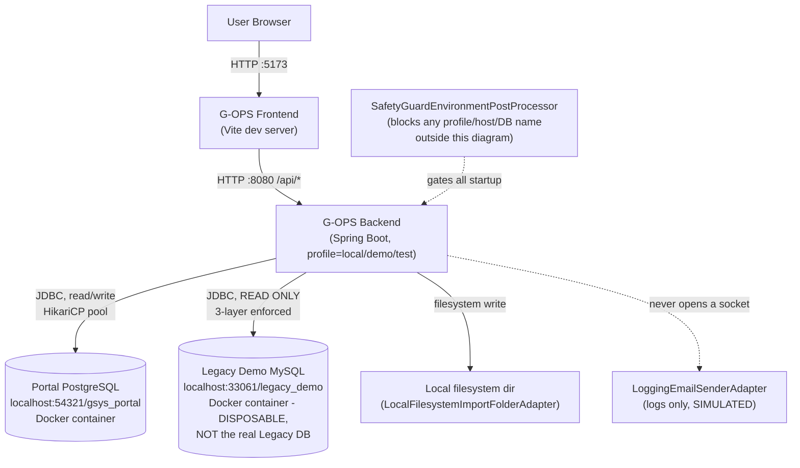

# G-OPS Production Architecture (Anticipated)

**Status**: Diagram only, derived from current implementation. No Hosting/Network/Vendor decision is implied or made by this document — every box marked **UNDECIDED** is a real open question, not a proposal. See `gops-production-readiness-audit.md` for the evidence behind each box, and `gops-production-question-list.md` for what needs to be answered before any of this can be built.

## 1. Current (Local/Demo/Test) Architecture — CONFIRMED, all boxes real



## 2. Anticipated Production Architecture — mix of CONFIRMED-code / UNDECIDED-infra

Every arrow below corresponds to real code that exists today (cited); every box labeled **UNDECIDED** has zero repository evidence of where/how it would actually run.

```mermaid
flowchart TB
    User["User Browser"] -->|HTTPS, UNDECIDED domain/TLS termination| FE["G-OPS Frontend<br/>UNDECIDED hosting"]
    FE -->|HTTPS /api/*| BE["G-OPS Backend<br/>profile=production<br/>UNDECIDED hosting<br/>(candidate only: EC2 - target-production-procurement-workflow.md)"]

    BE -->|JDBC read/write<br/>CONFIRMED code, UNDECIDED host| PDB[("Portal PostgreSQL<br/>UNDECIDED hosting<br/>(candidate only: RDS)")]

    BE -->|JDBC READ ONLY<br/>3-layer enforced (CONFIRMED)<br/>host/network UNKNOWN| LDB[("Legacy G-SYS MySQL<br/>Production<br/>Host/Network: UNKNOWN<br/>(Ernest Q13, unanswered)")]

    BE -->|"place(bytes, filename)"<br/>STUB - throws today| IF["G-SYS Official PO<br/>Import Folder<br/>Path/Protocol: UNKNOWN<br/>(Ernest Q2/Q7, unanswered)"]
    IF -.->|Legacy-side, outside Portal's reach<br/>trigger/schedule UNKNOWN| Batch["PrOfficialPoImportBatch<br/>(Legacy CLI batch, CONFIRMED to exist,<br/>trigger UNKNOWN)"]
    Batch --> LDB

    BE -->|"SmtpEmailSenderAdapter<br/>CODE COMPLETE, never run<br/>spring.mail.* UNDECIDED"| SMTP["SMTP Provider<br/>Provider/Credentials: UNDECIDED"]
    SMTP -.-> Manufacturer["Manufacturer"]

    BE -.->|"NO CODE EXISTS<br/>External Spec required"| EDI["EDI<br/>NOT CONFIGURED<br/>(deferred - Email-only viable start)"]
    EDI -.-> Manufacturer

    Guard["SafetyGuardEnvironmentPostProcessor<br/>currently REJECTS every arrow<br/>above except the Frontend/Backend box itself<br/>(Allowlist extension = Gate 2, one-way change)"] -.->|gates all startup| BE

    Secrets["Secret Store<br/>UNDECIDED (none exists today -<br/>current Local/Demo secrets are<br/>plaintext in application.yml, committed)"] -.->|would supply| BE

    Monitor["Monitoring/Alerting<br/>UNDECIDED (Health endpoints exist,<br/>Metrics/Alert provider not selected)"] -.->|would observe| BE

    Backup["Backup/Recovery<br/>UNDECIDED (no mechanism exists)"] -.->|would protect| PDB
```

## 3. Reading this diagram

- Solid arrows = code that runs this path today, in Local/Demo/Test, unmodified.
- Dashed arrows = either a path that exists only as an unreachable stub (`ProductionImportFolderAdapter`, `SmtpEmailSenderAdapter` under `@Profile("production")`), or a path with no code at all (EDI), or an operational/infra concern with no owner yet (Secrets, Monitoring, Backup).
- No vendor name in this document (AWS, specific SMTP provider, specific Secret Manager) is a decision — every one is copied verbatim from an existing docs/ file that itself labels it a "candidate" or "proposal," never a confirmed fact. See `gops-production-readiness-audit.md` §2 (Hosting) for the citations.
