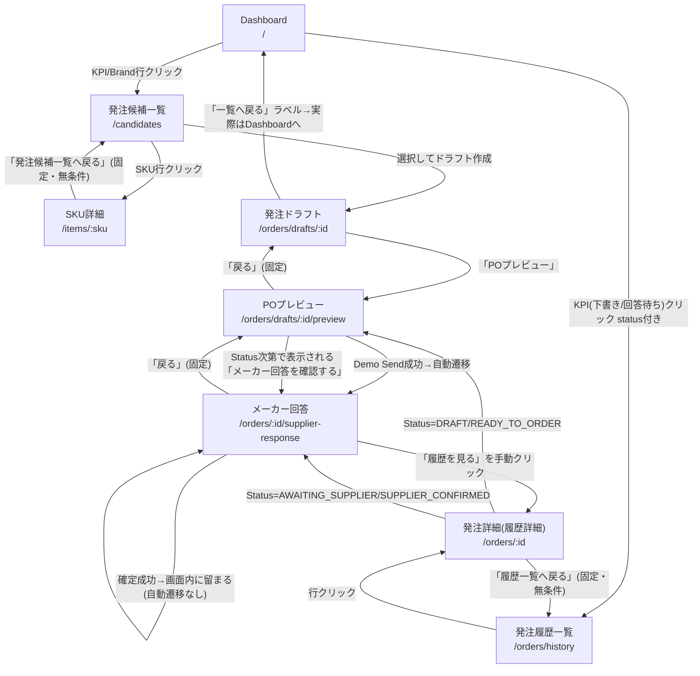
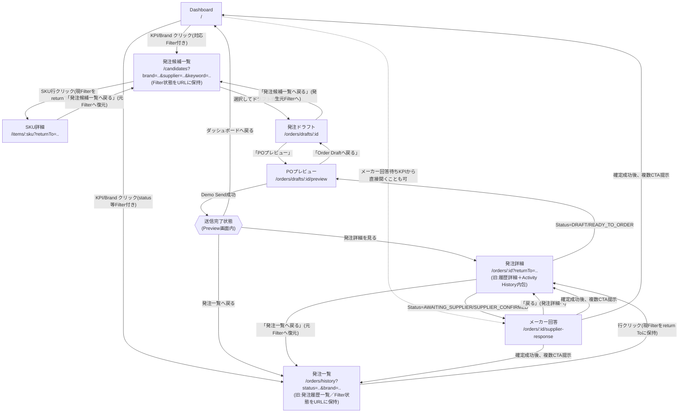

# Production-Oriented UX / Workflow Redesign（Phase 6 設計書）

**Status**: Draft — 顧客レビュー待ち。本Stepではソースコードは一切変更していない（監査・設計のみ）。
**対象**: Frontend Navigation / 業務導線（Business Status Transitionの変更は含まない）
**前提**: 本書の内容が承認された後に Phase 6-A から実装を開始する。承認前に実装は行わない。

---

## 0. 背景・課題認識（監査前の仮説）

現行Prototypeは「9/17デモシナリオを一直線に通す」ことを最適化した結果、以下の歪みを持っている。

1. "戻る"/"一覧へ戻る" Navigationが、業務上の文脈（どのFilterで見ていたか、どの一覧から来たか）を十分考慮していない。
2. 一覧 → 詳細 → "一覧へ戻る" でFilter/検索条件と位置が失われ、条件なしの全件一覧に戻ってしまう。
3. メーカーへの送信（Demo Send）直後、Supplier Response画面へ自動遷移する。実業務では「メーカーへ送信する行為」と「後日メーカーの回答を登録する行為」は別のタイミングで発生するため不自然。
4. Supplier Response確定直後、History（履歴）画面へ遷移する。Historyは業務の着地点ではなく、必要に応じて参照する情報のはずであり不自然。
5. 現行Navigation全体が、Demo Scenarioの進行順で組まれており、日々の業務タスク単位で組まれていない。

本書はこの仮説を実際のコード監査で検証し、あるべき業務導線を設計する。

---

## 1. 現状画面遷移図（監査結果）

### 1.1 現状の画面遷移（Mermaid）



### 1.2 現状監査テーブル（全8画面）

| # | 画面 | Entry Point | 主な業務目的 | 現在のBack/Next遷移 | 遷移先 | 一覧条件維持有無 | URL・Route | 問題点 | 推奨遷移 |
|---|---|---|---|---|---|---|---|---|---|
| 1 | Dashboard | ログイン直後／nav常時 | 本日のAction起点の把握（Action/Operation Cockpit） | KPI・Brand行クリックで各画面へ | `/candidates`, `/orders/history?status=...` | N/A（遷移元） | `/` | 欠品/長期欠品/要確認KPIに対応するFilterが遷移先に存在しない | 現状維持。Phase 6-Dで対応Filter拡充を検討（要CUSTOMER REVIEW） |
| 2 | 発注候補一覧 (CandidateList) | Dashboard KPI/Brand、nav「発注候補」 | 推奨発注数を見て発注対象を選定、ドラフト作成 | SKU行→SkuDetail、選択→ドラフト作成 | `/items/:sku`, `/orders/drafts/:id` | **なし**（`useSearchParams()`をmount時に一度だけ読みローカルstateへコピー。以降のFilter変更はURLに反映されない） | `/candidates`（brandCode等はmount時のみ反映） | Filter変更がURLに同期されないため、Detail等から戻ると条件が失われる | Filter状態をURLと双方向同期（Phase 6-A） |
| 3 | SKU詳細 (SkuDetail) | 発注候補一覧のSKU行 | 特定SKUの在庫/発注/Legacy PO実績の詳細確認 | 「発注候補一覧へ戻る」ボタンのみ | `/candidates`（固定・パラメータなし） | なし（固定遷移） | `/items/:sku` | ラベル自体は具体的だが、遷移先が無条件固定のため元Filterが失われる | 遷移元のFilterをそのまま復元して戻る（Phase 6-A） |
| 4 | 発注ドラフト (OrderDraft) | 発注候補一覧の「ドラフト作成」 | 推奨発注数を参考に人が発注数量を確定させる | 「一覧へ戻る」ボタン／「POプレビュー」ボタン | 実際は `navigate('/')`＝**Dashboard**、`/orders/drafts/:id/preview` | N/A（ラベルと遷移先が不一致というバグ） | `/orders/drafts/:id` | **ラベル「一覧へ戻る」なのに実際はDashboardへ遷移する表示上のバグ**。真の親画面（発注候補一覧）に戻れない | 発注候補一覧（元Filter付き）へ戻すよう修正、またはラベルを実態に合わせる（Phase 6-A） |
| 5 | POプレビュー (PoPreview) | 発注ドラフトの「POプレビュー」、発注詳細のStatus次第のリンク | メーカー送付前の最終確認、発注確定、Demo Send実行 | 「戻る」→Draft固定。Demo Send成功→Supplier Response自動遷移 | `/orders/drafts/:id`, `/orders/:id/supplier-response` | N/A | `/orders/drafts/:id/preview` | **Demo Send成功で強制的にSupplier Responseへ自動遷移**（「送信」と「後日の回答登録」が本来別タイミングなのに直結）。AWAITING_SUPPLIER/SUPPLIER_CONFIRMED状態でも本画面が再利用され「メーカー回答を確認する」ボタンが表示されるなど役割が曖昧化 | Demo Send成功時は自動遷移せず「送信完了」状態を提示し、複数の次アクションを選ばせる（Phase 6-C） |
| 6 | メーカー回答 (SupplierResponse) | （現状）POプレビューからのDemo Send成功時自動遷移、または発注詳細のStatus次第のリンク | メーカーからの回答数量/納期を記録 | 「戻る」→Preview固定。確定成功→ダイアログを閉じるのみ（**自動遷移なし**）。「履歴を見る」を手動クリックすると `/orders/:id` へ | `/orders/drafts/:id/preview`, `/orders/:id` | N/A | `/orders/:id/supplier-response` | **訂正**：ユーザー指摘の「確定直後にHistoryへ遷移する」は技術的には不正確 — 実際は自動遷移せず、確定後の画面に留まる。ただし確定後は「履歴を見る」以外の選択肢が画面上に存在せず、実質的にHistoryへの一本道になっており体感的には強制に近い。「戻る」の遷移先がPreview固定なのも、送信済みの文脈では不自然 | 「戻る」を発注詳細へ変更。確定後は「発注詳細を見る」「発注一覧へ戻る」「ダッシュボードへ」等の複数CTAを提示（Phase 6-C） |
| 7 | 発注履歴一覧 (OrderHistoryList) | nav「発注履歴」、Dashboard KPI/Brand（status付き） | 過去〜現在の発注を一覧で確認・絞り込み | 行クリック→Detail | `/orders/:id` | **なし**（CandidateListと同じ `useSearchParams()` 初回読み取りのみの実装） | `/orders/history`（status/brandCode等はmount時のみ反映） | Filter変更がURLに同期されない。「要確認」に絞り込むFilterが存在しない | Filter状態をURLと双方向同期（Phase 6-A）。名称/位置づけを「発注一覧」へ格上げ検討（Phase 6-B） |
| 8 | 発注詳細/履歴詳細 (OrderHistoryDetail) | 発注履歴一覧の行、メーカー回答画面の「履歴を見る」 | 発注基本情報・明細（推奨/発注/回答数量等）・Activity Historyを一画面で確認 | 「履歴一覧へ戻る」固定。Status次第でPreview/SupplierResponseへの導線あり | `/orders/history`, `/orders/drafts/:id/preview`, `/orders/:id/supplier-response` | なし（固定遷移） | `/orders/:id` | 元Filterが失われる。画面自体は既に「発注基本情報＋明細＋Activity History」を備えており、ユーザーが求める"Order Detail"像にほぼ一致しているが、位置づけが「履歴」寄りのまま | 一覧へ戻る際は元Filterを復元（Phase 6-A）。本画面を発注の中心画面「発注詳細」として明確に位置づけ直す（Phase 6-B） |

**この段階ではまだ実装しない。** 以降は上記監査結果に基づくTarget設計。

---

## 2. 問題点（整理）

Section 0の仮説を、監査結果で裏付け／訂正する。

1. **戻るNavigationが業務文脈を考慮していない** — 確認。SkuDetail・OrderHistoryDetail・OrderDraft・SupplierResponseの「戻る」系ボタンは全て固定URLへの `navigate()` で、遷移元の状態（どのFilterで見ていたか）を一切考慮していない。
2. **Filter/検索条件が一覧復帰時に失われる** — 確認。根本原因は `CandidateListPage` と `OrderHistoryListPage` がともに `useSearchParams()` をmount時に一度だけ読み取ってローカル `useState` にコピーし、以降のFilter変更をURLへ書き戻していないこと。この結果、たとえURL Query Parameterを使ったとしても現状はFilter変更がURLへ反映されないため、ブラウザBack/Forwardはおろか、明示的な「一覧へ戻る」ボタンでも条件を復元できない。
3. **Demo Send成功時、Supplier Responseへ自動遷移する** — 確認。`PoPreviewPage.handleDemoSend()` の `onSuccess` が `navigate('/orders/${draftId}/supplier-response', ...)` を直接呼んでいる。Status Transition（Business Logic）とNavigation（UX）が同一のコールバック内で密結合している具体例。
4. **Supplier Response確定直後、Historyへ自動遷移する** — **一部訂正**。実際のコードは自動遷移していない（`handleConfirm()` の `onSuccess` はダイアログを閉じるのみ）。ただし確定後の画面には「履歴を見る」ボタン以外の次アクションが用意されておらず、他に選べる選択肢がないという意味で実質的に一本道になっている。ユーザーの問題意識自体は妥当だが、原因は「自動遷移」ではなく「次アクションの選択肢不足」である。この訂正は正確性のため明記する。
5. **Navigation全体がDemo Scenario順で組まれている** — 確認。Preview→SupplierResponseの自動遷移、SupplierResponse→Historyへの実質一本道、および一覧条件非維持のいずれも、"1回のデモを最短で通す"ことに最適化された結果であり、日々の業務でCandidate List・Order Listへ何度も出入りする使い方を想定していない。

**追加で判明した問題点（ユーザー指摘に含まれていなかったもの）**：

- **OrderDraftPageの「一覧へ戻る」ラベルは、実際の遷移先（Dashboard）と一致していない表示上のバグ**。ラベルだけを信じるとユーザーは「一覧に戻れる」と期待するが、実際にはDashboardへ飛ばされる。
- Dashboardの「欠品」「長期欠品」「要確認」KPI/Brand列は、遷移先の一覧画面に対応するFilterが存在しないため、KPIをクリックしても絞り込まれた状態にならない（全件表示になる）。

---

## 3. Target画面遷移図



**変更方針の要点**：

- Preview→SupplierResponseの自動遷移を廃止し、「送信完了」という明示的な中間状態を挟む。
- SupplierResponseの着地先をHistory（履歴）からOrder Detail（発注詳細）へ変更し、Detail側からSupplierResponseへ「必要な時に開く」形に反転させる。
- 一覧⇄詳細の往復はすべてFilter状態を保持する。
- ルートパス自体（`/candidates`, `/orders/history`, `/orders/:id` 等）は変更しない。名称・位置づけ・Query Parameter運用のみを変える（後述、破壊的変更を避けるための方針）。

---

## 4. 各画面の役割（Target）

| 画面 | Target上の役割 |
|---|---|
| Dashboard | 本日のAction起点（Action/Operation Cockpit）。全KPI/Brand行が、対応するFilter済みの一覧へのDeep Linkとして機能する。 |
| 発注候補一覧 | 「何を・いくつ発注すべきか」を検討し選定する画面。Filter状態はURLに保持され、SKU詳細やドラフト作成から戻っても保持される。 |
| SKU詳細 | 個別SKUの深掘り参照画面。発注候補一覧から来た場合、必ずそのFilter状態へ戻れる。 |
| 発注ドラフト | 人が最終発注数量を決める画面。戻る先は発生元（通常は発注候補一覧）。 |
| POプレビュー | 送信前の最終確認・確定・送信専用画面。送信後は「送信完了」状態を提示し、それ以降のPreview再利用（メーカー回答確認ボタンの表示等）はOrder Detail側に集約し廃止する。 |
| メーカー回答 (SupplierResponse) | 送信後、独立した業務タスクとして開かれる回答登録画面。Dashboard／発注一覧／発注詳細のいずれからも開始できる。戻る先はOrder Detail。 |
| 発注一覧（旧: 発注履歴一覧） | 全発注のStatus別・Brand別・Supplier別の一覧・検索画面。真の意味での「業務上の発注一覧」として位置づけ直す。Filter状態はURLに保持。 |
| 発注詳細（旧: 履歴詳細） | その発注に関するすべて（基本情報・明細・推奨/発注/確定数量・Attention・Supplier Response状況・Activity History）が集約された中心画面。History機能はここに「操作履歴」セクションとして内包する（削除しない）。 |

---

## 5. Back Navigation設計

### 5.1 原則

- A. Demo Scenarioの進行順ではなく、業務タスク単位でNavigationを組む。
- B. 「戻る」は原則として単純な `history.back()` ではなく、業務上の親画面へ明示的に遷移する。ただし親画面の判定は「固定値」ではなく「発生元」を考慮する（例: 発注ドラフトの親は通常は発注候補一覧だが、将来的に別経路から開かれる可能性を残す）。
- C. 一覧→詳細→一覧は、Filter/検索条件を必ず保持する。
- D. Transaction完了後、次のBusiness Actionへ自動的に飛ばさない。完了状態を提示し、選択肢を人に委ねる。

### 5.2 画面ごとの戻る先（Target）

| 画面 | 現状の戻る先 | Target戻る先 | 判定方法 |
|---|---|---|---|
| SKU詳細 | `/candidates`（固定） | 発生元の発注候補一覧（Filter付き） | `returnTo` Query Parameter |
| 発注ドラフト | `/`（Dashboard、ラベルと不一致） | 発生元の発注候補一覧（Filter付き） | `returnTo` またはNavigation State。発生元が不明な場合（直接URL等）はFilterなしの発注候補一覧へ |
| POプレビュー | Draft（固定） | 現状維持（Preview→Draftは常に正しい親子関係のため変更不要） | 固定でよい |
| メーカー回答 | Preview（固定） | 発注詳細 | 固定変更（送信済みの文脈でPreviewへ戻るのは常に不自然なため） |
| 発注一覧（旧履歴一覧） | N/A（Dashboardや行クリックからの遷移先） | 変更なし | — |
| 発注詳細（旧履歴詳細） | `/orders/history`（固定） | 発生元の発注一覧（Filter付き） | `returnTo` Query Parameter |

---

## 6. List State Preservation設計

### 6.1 方式の決定

ユーザー提案どおり **URL Query Parameterを第一候補として採用する**（共有可能、Back/Forwardに強い）。現状のRoute構成（`BrowserRouter`、`react-router-dom` の `useSearchParams`）を確認した結果、この方式は既存Architectureに自然に乗る。大きなRoute変更は不要。

### 6.2 一覧側：Filterの双方向URL同期

現状の根本原因（`useSearchParams()` をmount時に一度だけ読む）を解消し、Filter変更のたびに `setSearchParams(..., { replace: true })` でURLへ書き戻す。`replace: true` を使うことで、Filterを1文字打つたびに履歴が積み上がるのを防ぐ。

**発注候補一覧** (`/candidates`):
```
/candidates?brand=LIVORA&supplier=SUP_GAMMA&keyword=mug&page=1&sort=recommendedQty:desc
```
| パラメータ | 内容 | 必須 |
|---|---|---|
| `brand` | Brand Code | 任意 |
| `supplier` | Supplier Code | 任意 |
| `keyword` | SKU/商品名キーワード | 任意 |
| `page` | ページ番号 | 任意（Pagination実装有無は[SOURCE REVIEW]、13章参照） |
| `sort` | ソート項目:方向 | 任意 |

**発注一覧**（旧: 発注履歴一覧, `/orders/history`）:
```
/orders/history?status=AWAITING_SUPPLIER&brand=LIVORA&supplier=SUP_GAMMA&keyword=PO-2026&page=1&sort=orderDate:desc
```
| パラメータ | 内容 | 必須 |
|---|---|---|
| `status` | Order Status（DRAFT/READY_TO_ORDER/AWAITING_SUPPLIER/SUPPLIER_CONFIRMED） | 任意（既存実装済み） |
| `brand` | Brand Code | 任意（既存実装済み） |
| `supplier` | Supplier Code | 任意（新規） |
| `keyword` | PO No./SKU等 | 任意（新規、Filter UI自体が未実装なら6-Bで追加検討） |
| `page` / `sort` | 同上 | 任意 |

スクロール位置の保持は優先度を下げる（Section 2の「必須ではない」に該当）。まずBrand/Supplier/Keyword/Status/Page/Sortを対象とする。

### 6.3 詳細側：`returnTo` による戻り先の保持

一覧から詳細への遷移時、一覧側が自分自身の現在のURL（パス＋クエリ）を `returnTo` としてDetail URLに埋め込む。

```
/items/mug-001?returnTo=%2Fcandidates%3Fbrand%3DLIVORA%26keyword%3Dmug
/orders/PO-2026-0001?returnTo=%2Forders%2Fhistory%3Fstatus%3DAWAITING_SUPPLIER
```

- Detail画面の「戻る」ボタンは `returnTo` があればそれへ、なければ現状と同じデフォルト（無条件の一覧トップ）へ遷移する。
- `returnTo` は一覧側のURL自体をそのまま使うため、二重管理にならない。
- ブラウザの戻るボタン・直接URLアクセス・ブックマークいずれの経路でも、少なくとも「Filterなしの正しい一覧」には必ず戻れることを最低保証とする。

---

## 7. Send後の遷移

**現状**: `PoPreviewPage.handleDemoSend()` の `onSuccess` で `navigate('/orders/${draftId}/supplier-response')` を直接呼び出し、強制的にSupplier Response画面へ遷移する。

**Target**: 自動遷移を廃止し、Preview画面内に「送信完了」状態を表示する。

- Demo Send成功後、Preview画面のURLは変えず、画面内に成功状態（現行の `confirmSuccess` Alert表示と同様のパターン）を表示する。
- 表示する次アクションは以下の3つ（自動遷移は行わない）:
  1. 「発注詳細を見る」→ `/orders/:id`（今回の発注のOrder Detail）
  2. 「発注一覧へ戻る」→ `/orders/history`（可能なら遷移元のFilterを復元）
  3. 「ダッシュボードへ戻る」→ `/`
- **Business Status Transition（`demoSendMutation` によるREADY_TO_ORDER→SENT→AWAITING_SUPPLIERの変更）は一切変更しない**。変更するのはUI表示と、成功後に呼ばれる `navigate()` の削除のみ。

---

## 8. Supplier Response後の遷移

**現状（訂正済み）**: `SupplierResponsePage.handleConfirm()` の `onSuccess` は自動遷移せず、ダイアログを閉じて画面内に留まる。ただし提示される次アクションが「履歴を見る」ボタン1つのみ。

**Target**:

- 「戻る」ボタンの遷移先をPreview固定からOrder Detail固定へ変更する。
- 確定成功後に提示するCTAを3つに拡張する:
  1. 「発注詳細を見る」（既存の「履歴を見る」ボタンをリラベル・意味づけ変更。遷移先URLは `/orders/:id` のまま変更不要）
  2. 「発注一覧へ戻る」（新規追加）
  3. 「ダッシュボードへ戻る」（新規追加）
- Supplier Response自体への入口も、Preview経由の一本道から、Dashboardの「メーカー回答待ち」KPI／発注一覧／発注詳細のいずれからも開始できる、独立した業務タスクとして開放する。
- **Business Status Transition（`confirmMutation` によるAWAITING_SUPPLIER→SUPPLIER_CONFIRMEDの変更）は一切変更しない**。

---

## 9. Order List / Order Detail構想

### 9.1 既存Historyの再利用可能性調査（結論: 高い）

`docs/GSYS_Specification.md` に既存の `[PROTOTYPE DECISION]` がある：

> Order Historyは単なる発注一覧ではなく、新Portal上で行われた操作・変更を追跡できるAudit Trailとして実装する。（`GSYS_Specification.md:1068`）

この決定と、今回のユーザー要求（Section 4/5: Historyを削除せずOrder Detail内の「操作履歴」セクションとして扱う）は**矛盾しない**。理由:

- `OrderHistoryListPage`（一覧側）は現状でも1行＝1発注（Audit Eventの羅列ではない）であり、実質的にすでに「発注一覧」の形をしている。Audit Trailとしての性質は主に **詳細側の Activity History セクション** に宿っている。
- したがって「一覧の位置づけ・名称を発注一覧へ格上げする」ことは、Audit Trailとしての性質を持つ詳細側のActivity Historyセクションを変更・削除することを意味しない。既存 `[PROTOTYPE DECISION]` との整合は取れる。

### 9.2 発注詳細（Order Detail）の現状カバレッジ

`OrderHistoryDetailPage`（`/orders/:id`）は、既にユーザーが求める内容のほとんどを備えている：

| ユーザーが求める項目 | 現状の実装 |
|---|---|
| 発注基本情報 | ✅ Supplier/Brand/発注日/希望納期/通貨/備考 |
| Order Lines | ✅ 明細テーブル |
| Recommended Qty / Ordered Qty / Confirmed Qty | ✅ 3列とも表示済み |
| Requested Delivery / Confirmed Delivery | ✅ |
| Attention | ✅ 明細レベル/発注レベルとも表示済み |
| Supplier Response status | ❌ **未実装**（`SupplierResponse.responseStatus`=PARTIAL/CONFIRMED はBackend Modelに存在するがFrontend未表示。9.3参照） |
| Activity History | ✅ 既存の `resolveTimelineValue()` により i18n翻訳済みで表示済み |

**結論**: Phase 6-Bで新規に画面を作る必要はない。既存 `OrderHistoryDetailPage` を「発注詳細」として再定義・再配置し、不足する `Supplier Response status` の表示可否を検討する（CUSTOMER REVIEW対象、9.3参照）。

### 9.3 発注一覧（Order List）の列構成

ユーザー希望の列（PO No./Supplier/Brand/発注日/Status/合計数量/合計金額/Attention/更新日時）は、`OrderHistoryListPage` に**既にほぼそのまま実装済み**であることを確認した。Status Filterも `t('status:orderStatus.X')` を用いてi18n Label化済みで、Section 5の要件（内部Codeを露出しない）を既に満たしている。追加で必要なのは、名称・位置づけの変更（「発注履歴」→「発注一覧」、CUSTOMER REVIEW対象）と、6.2節のFilter URL同期のみ。

---

## 10. Dashboard Deep Link

| KPI/Brand列 | 現状の遷移先 | Target | 備考 |
|---|---|---|---|
| 発注候補 | `/candidates` | `/candidates`（変更なし） | 既にFilterなしの適切な遷移 |
| 欠品 / 長期欠品 | `/candidates`（Filterなし） | 現状維持、または`stockFilter`等の新規Filterを追加 | 「欠品」の判定基準の確定が必要なため、新規Filter追加はCUSTOMER REVIEW対象（Section 10ルールにより独断で決めない） |
| 発注作成中 (draft) | `/orders/history?status=DRAFT` | 変更なし | 既に正しく実装済み |
| メーカー回答待ち | `/orders/history?status=AWAITING_SUPPLIER` | 変更なし | 既に正しく実装済み |
| 要確認 (attention) | `/orders/history`（Filterなし） | 「Attention有無」Filterを新設し `?hasAttention=true` 等で絞り込み | 新規Filter追加はCUSTOMER REVIEW対象 |
| Brand行の各列 | 上記と同様のパターン | 上記と同様 | 既にBrandCodeを引き継ぐ実装は存在し、良い前例として踏襲する |

Query Parameterの命名は、6.2節で確定するCandidateList/OrderListのパラメータ名（`brand`, `supplier`, `keyword`, `status`）に合わせて統一する。

---

## 11. Phase 6-A〜E 実装計画

| Phase | 対象 | 変更内容 | Risk | 必要Test | Est |
|---|---|---|---|---|---|
| **6-A**<br/>Navigation / List State Preservation | `CandidateListPage`, `OrderHistoryListPage`, `SkuDetailPage`, `OrderHistoryDetailPage`, `OrderDraftPage` | Filter状態のURL双方向同期。`returnTo`によるDetail→List復帰。OrderDraftPageの「一覧へ戻る」ラベル/遷移先不一致の是正 | 低（追加的な変更が中心。既存API/Business Logicには触れない） | Playwright: Filter→Detail→戻るで条件保持、ブラウザBack/Forward、直接URLアクセスでのFilter事前反映、既存Walkthrough E2Eが引き続きGreen | 1.5〜2日 |
| **6-B**<br/>Order List / Order Detail 再編 | `OrderHistoryListPage`, `OrderHistoryDetailPage`, `common.json`のnavラベル, `App.tsx`のnavハイライト確認 | 名称/位置づけの変更（「発注履歴」→「発注一覧」等、CUSTOMER REVIEW後）。`SupplierResponse.responseStatus`の表示可否検討・実装 | 低〜中（ラベル変更中心。`responseStatus`表示は既存APIに含まれるか要確認、9-3節/13章参照） | i18n Key更新反映のPlaywrightラベルAssertion更新、視覚確認 | 1〜1.5日 |
| **6-C**<br/>Send後／Supplier Response確定後の業務導線修正 | `PoPreviewPage.handleDemoSend`, `SupplierResponsePage`（戻る先、確定後CTA） | Demo Send成功時の自動遷移を廃止し「送信完了」状態＋3択CTAを追加。SupplierResponseの戻る先をOrder Detailへ変更。確定後CTAを3つに拡張 | 中（既存Walkthrough E2EはPreview→SupplierResponse自動遷移を前提にしたAssertionを含む可能性が高く、Test改修が必須。Business Logic自体は不変） | Playwright Walkthrough該当箇所の全面書き換え、Demo Send/確定操作の手動スモークテスト、`demoSendMutation`/`confirmMutation`のPayload不変確認 | 2日 |
| **6-D**<br/>Dashboard Deep Link精緻化 | `DashboardPage`のKPI/Brand行クリックハンドラ | 6-A/6-Bで確定したParameter名への統一。（CUSTOMER REVIEW承認後）欠品/要確認向けの新規Filter追加とKPI連携 | 低（Parameter統一のみ）〜中（新規Filter追加時。業務定義の確定が前提） | Playwright: Dashboard→各一覧のDeep Link Assertion（KPI別・Brand行別） | 1日（+新規Filter追加時は+1日） |
| **6-E**<br/>全画面UX一貫性監査 | 全8画面のラベル・ボタン配置・エラー文言・空状態文言 | i18n Key整理、ボタン配置順の統一、ja/en Resource整合性の最終確認 | 低（Copy/UIのみ） | i18n Key ja/en整合Lint、Playwright全体Suite Green、画面ごとの手動最終確認 | 1日 |

**合計目安**: 6.5〜8.5日（5 Phase、原則この順で逐次実施を推奨。6-Cは6-Bの「発注詳細」という前提を使うため6-Bの後に行う）。

---

## 12. CUSTOMER REVIEW事項

1. `OrderHistoryList`/`OrderHistoryDetail`の名称変更（「発注履歴」→「発注一覧」/「発注詳細」）を正式採用してよいか。既存Spec（`[PROTOTYPE DECISION]` History=Audit Trail）との整合は取れているが、顧客向け用語としての定着状況を確認したい。
2. Dashboardの「欠品」「長期欠品」KPIに対応するCandidate List側のFilterを新設するか。新設する場合、「欠品」の判定基準（在庫=0か、安全在庫割れか等）を確定する必要がある。
3. Dashboardの「要確認」KPI／Brand別「要確認」列に対応する一覧側Filter（Attention有無）を新設するか。
4. `SupplierResponse.responseStatus`（PARTIAL/CONFIRMED）をOrder Detail画面に新規表示するか（現状Frontend未表示。表示する場合の文言・位置も要確認）。
5. Send完了後・Supplier Response確定後に提示する3択CTAの文言・並び順（「発注詳細を見る」/「発注一覧へ戻る」/「ダッシュボードへ戻る」）が実際の業務感覚と合っているか。
6. `OrderDraftPage`の「一覧へ戻る」問題（13章SOURCE REVIEW #1参照）について、望ましい着地画面は「発注候補一覧」でよいか。それとも将来的に「下書き一覧」的な位置づけを別途検討するか。

---

## 13. SOURCE REVIEW事項

1. `OrderDraftPage.handleBack()` は現在ラベル「一覧へ戻る」に反して実際には `navigate('/')`（Dashboard）に遷移しており、ラベルと挙動が不一致（表示上のバグ）。Phase 6-Aで是正が必要。
2. `CandidateListPage`/`OrderHistoryListPage` は `useSearchParams()` を初回マウント時に一度だけ読み取りローカル `useState` へコピーしており、以降のFilter変更がURLへ反映されない実装になっている。Phase 6-Aで双方向同期に変更が必要。
3. `CandidateListPage` にPagination（Page/Sort）が実装されているか、本Auditの範囲では未確認。Section 6.2のPage/Sort Parameter設計はこの確認が前提となる。実装前に要コード確認。
4. `SupplierResponse.responseStatus` をOrder Detail APIレスポンスに含めるにはBackend DTO変更が必要か、Frontendの表示のみで完結するかは未調査。Phase 6-B着手前の確認が必要。
5. `PoPreviewPage` は現在AWAITING_SUPPLIER/SUPPLIER_CONFIRMED状態でも表示され「メーカー回答を確認する」ボタンを持つなど、Send後の画面としても流用されている。Phase 6-Cで「送信完了」を独立した状態表示にする際、この既存流用ロジックとの重複・競合を整理する必要がある。
6. 既存Playwright E2E（Demo Send後→Supplier Response自動遷移、Supplier Response確定→履歴閲覧導線を前提としたAssertion）は現在の遷移仕様に依存している可能性が高く、Phase 6-C実装時に合わせたTest更新が必須。

---

## 14. 最終報告（サマリ）

1. **現状Navigationの問題点一覧** — 2章参照。うち1点（Supplier Response確定後の自動遷移）はユーザー指摘とコード実態にズレがあり、訂正のうえ記載（実際は「自動遷移」ではなく「選択肢不足による実質一本道」）。もう1点、ユーザー指摘に含まれていなかった `OrderDraftPage` の「一覧へ戻る」ラベル不一致バグを新規発見。
2. **Target Navigation概要** — 3章のMermaid図参照。業務タスク単位のNavigation、Filter状態保持、Transaction完了後の非自動遷移を骨子とする。
3. **一覧条件維持の方式** — URL Query Parameter（Filterの双方向同期）＋詳細側`returnTo`パラメータ。6章参照。
4. **Send後の推奨遷移** — 自動遷移を廃止し「送信完了」状態＋3択CTA（発注詳細/発注一覧/ダッシュボード）。7章参照。
5. **Supplier Response確定後の推奨遷移** — 戻る先をOrder Detailに変更、確定後CTAを3つに拡張。8章参照。
6. **Order List/Order Detail再設計案** — 既存`OrderHistoryList`/`OrderHistoryDetail`の再利用（新規構築は不要）。9章参照。
7. **Dashboard再設計案** — 既存KPI/Brand行の大半は既に正しくDeep Link済み。欠品/要確認の2 KPIのみFilter新設が必要（要CUSTOMER REVIEW）。10章参照。
8. **Phase 6-A〜E** — 11章参照。合計目安6.5〜8.5日。
9. **CUSTOMER REVIEW事項** — 12章、6項目。
10. **SOURCE REVIEW事項** — 13章、6項目。
11. **作成ドキュメントパス** — `docs/production-ux-workflow-redesign.md`（本ファイル）。
12. **ソースコード変更ゼロの確認** — 本Stepで変更したファイルは本ドキュメントのみ。`phasep-gulliver/`・`frontend/`・`backend/` 配下のソースコードは一切変更していない（後述のGit差分で確認済み）。

**次のアクション**: 本設計書の内容についてユーザー（Techlead経由含む）の確認・承認をお願いします。承認後、Phase 6-Aから実装を開始します。
