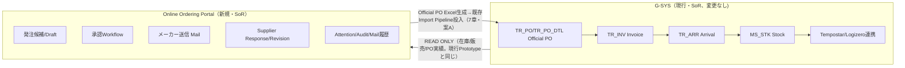
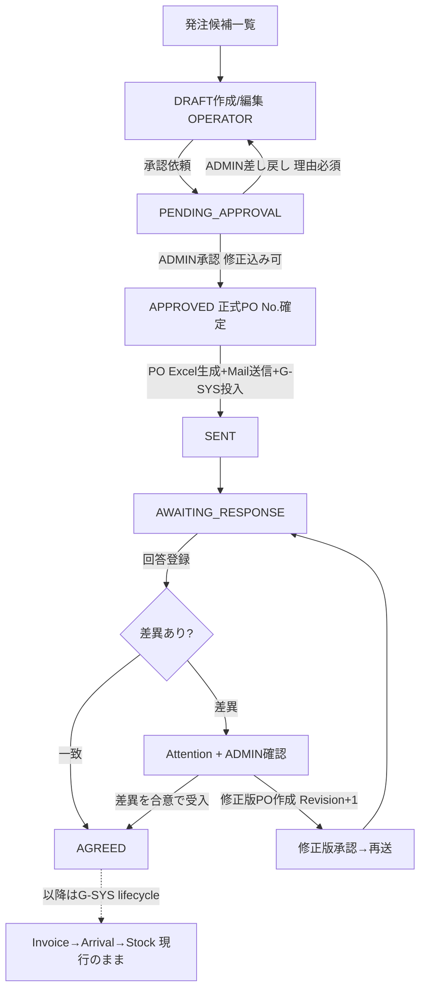
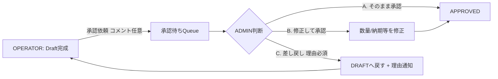
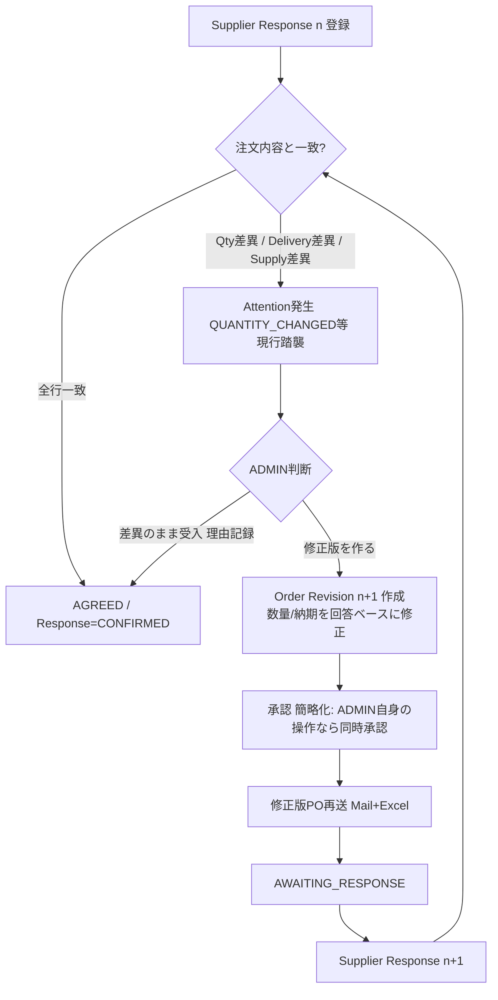
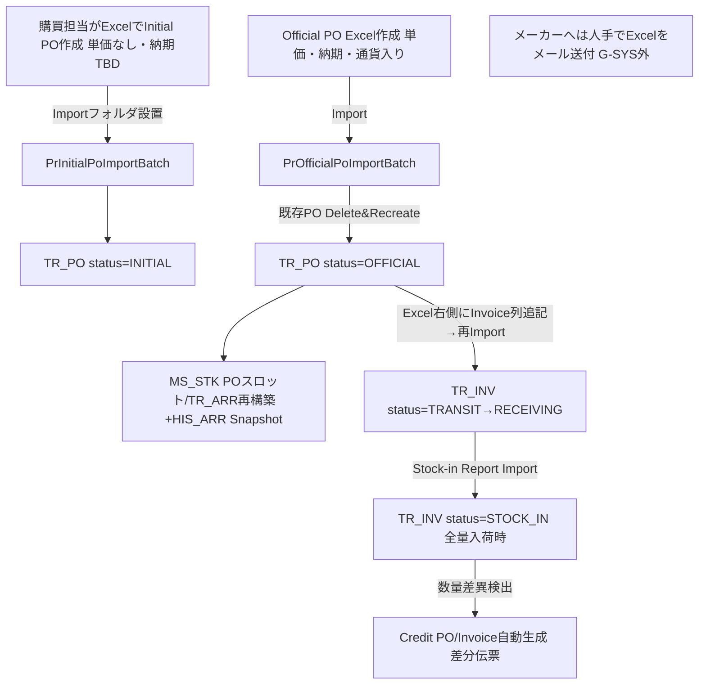

# Target Production Procurement Workflow Design（Phase 7-B）

**Status**: 設計完了・CUSTOMER REVIEW待ち（2026-08-28）。本Phaseは設計のみで、Source Code変更ゼロ（Prototype側・Legacy側とも）。
**基礎資料**: `docs/legacy-procurement-workflow-reverse-engineering.md`（Phase 7-A、Source根拠付き）。本書で「7-A §n」はその章番号を指す。
**表記**: 各設計項目に区分タグを付す — `[現行踏襲]` / `[現行を安全に改善]` / `[新規要件]`。

---

## 1. Executive Summary

本Portalは **G-SYSの置き換えではなく、「発注の意思決定からメーカー合意まで」をオンライン化する前工程システム** である。正式PO確定後はG-SYSの既存PO/Invoice/Arrival/Stock lifecycleへ接続し、以降の入荷・在庫・Tempostar/Logizero連携は現行のまま動かす。

設計の要点：

1. **境界**: Portal = Draft・承認・メーカー通信・回答・Attention・Audit・メール履歴のSoR。G-SYS = Official PO・Invoice・Arrival・Stock・外部連携のSoR（変更なし）。
2. **Official PO作成は「Portal生成のOfficial PO Excelを既存Import Pipelineへ投入する」方式（案A）を推奨**。Legacy変更ゼロで、現行のValidation・MS_STK/TR_ARR再構築・履歴Snapshotの全連鎖を無償で再利用できる（7章）。
3. **Statusは1本の巨大Statusにせず、4軸（Workflow / Response / Fulfillment / Supply）に分離**（21→18章・State Model）。現行G-SYSがPOとInvoiceでlifecycleを分けている構造（7-A §2, §9）とも整合する。
4. **承認Workflowは現行に存在しない新規要件**（7-A §15）。OPERATOR起票→ADMIN承認（そのまま承認/修正して承認/差し戻し）を新設し、全操作をField粒度Auditする。
5. **メーカー回答はRevision方式**。Order Revision n ⇄ Supplier Response n の往復履歴を残し、差異→修正版再送→再回答→合意のループを1つのPOの中で表現する。現行Credit POの「元を書き換えず差分を別Recordで表す」思想（7-A §8）の応用。
6. **Excel共存は「行単位revision埋込 + Upload時diffプレビュー」の組合せを推奨**。現行の無防備なDelete & Recreate（7-A §4, §12）に対する最小で効果的な防御。

---

## 2. Design Principles

1. **G-SYSの事実を尊重する** — 7-Aで確定した17のCONFIRMED事項を設計前提とする（各所に引用）。
2. **不便の再現はしない** — Delete & Recreateによる履歴喪失、競合検出なし、承認なし、はPortal側で改善する。ただし改善はPortalの領域内で行い、Legacyの挙動は変えない。
3. **区分の明示** — 全設計項目を [現行踏襲] / [現行を安全に改善] / [新規要件] に分類し、新規要件は必ずCUSTOMER REVIEWに接続する。
4. **Statusを増やしすぎない** — 業務の関心事ごとに軸を分け、各軸は4〜6値に抑える。
5. **確定は履歴付きで訂正可能** — 現行Arrival思想（7-A §11）をPortal全体の原則に昇格させる。

## 3. System Boundary



- Portal→G-SYSの書込み経路は**Official PO Excel投入の1本のみ**（7章）。
- Tempostar/LogizeroへPortalから直接連携しない [現行踏襲]。
- Invoice/Arrival/Stock情報はPortalからはREAD ONLY参照（未納表示等に使用、14章）。

## 4. User Roles

Role原則2種 [新規要件 — 現行は実質権限制御なし、7-A §15]：

| 操作 | OPERATOR | ADMIN |
|---|---|---|
| 発注候補確認 / Draft作成・編集・保存 | ○ | ○ |
| 承認依頼 | ○ | （不要・自己承認） |
| Draft修正（他者分含む）・承認・差し戻し | × | ○ |
| 正式PO化・メーカー送信 | ×（例外あり↓） | ○ |
| Supplier Response登録 | ○ | ○ |
| Supplier Response確定・確定後訂正・差異対応Close | × | ○ |
| Master管理（Supplier Contact / Mail Template） | × | ○ |

**例外設計候補**: 海外SupplierについてはOPERATOR自身が発注確定できるケースがあるため、Roleに加えて **Permission Matrix（Role × Supplier/Region/Procurement Type）** を用意する。実装はUser Masterの `selfApprovalScope`（Supplier Code/Region のリスト）として持ち、該当Scopeの発注はOPERATORでも承認〜送信まで実行可とする。**Scopeの実際の範囲・粒度はCUSTOMER REVIEW #3**。

## 5. Target Order Lifecycle

### 5.1 Workflow Status（1軸目 — 発注の進行）

指示4章の10 Status案は関心事が混在するため、**Response以降を別軸に分離して6値に圧縮**する（18章）：

```
DRAFT → PENDING_APPROVAL → APPROVED → SENT → AWAITING_RESPONSE → AGREED
```

| Status | 意味 | 現行対応物 |
|---|---|---|
| DRAFT | 起票中（OPERATOR編集可） | Initial PO作成前のExcel編集 [現行踏襲の細分化] |
| PENDING_APPROVAL | 承認依頼済（OPERATOR編集ロック） | なし [新規要件] |
| APPROVED | ADMIN承認済・正式PO No.確定・Official PO Excel生成可 | Official Excel作成完了に相当 |
| SENT | メーカーへメール送信済（G-SYSへのOfficial PO投入もこの時点、7章） | Official PO Import + 人手メール送付 [現行を安全に改善] |
| AWAITING_RESPONSE | 回答待ち | なし（現行は管理外）[新規要件] |
| AGREED | 双方合意でClose（回答一致 or 差異合意） | なし [新規要件] |

- `OFFICIAL_PO_CREATED`は独立Statusにしない（APPROVED→SENTの内部処理として実行。失敗時はAPPROVEDに留まりエラー表示）。
- `HANDED_OVER_TO_GSYS`も独立Statusにしない（SENT時にG-SYS投入済のため。投入結果はイベントとしてAuditに記録）。
- **既存Prototype Statusの移行Mapping**: DRAFT→DRAFT、READY_TO_ORDER→APPROVED、SENT→SENT、AWAITING_SUPPLIER→AWAITING_RESPONSE、SUPPLIER_CONFIRMED→AGREED（+Response Status=CONFIRMED）。移行はDB MigrationでのStatus値変換1回で完了する見込み（19章）。

### 5.2 Target全体Flow（Mermaid）



## 6. Approval Workflow [新規要件]



- **B（修正して承認）**の修正は通常のDraft編集と同じAuditEvent（Field単位Before/After/User/Timestamp）で記録し、さらに`APPROVED_WITH_CHANGES`イベントを追加して「承認者が値を変えた」ことを明示する。
- **C（差し戻し）**は理由テキスト必須。`RETURNED_TO_DRAFT`イベント+理由をAuditに保持し、OPERATORのDraft画面に差し戻し理由バナーを表示。
- 承認依頼の通知はDashboard KPI（「承認待ち」）+ 任意でメール通知（SYS_SEND_MAIL再利用）。
- 自己承認（4章のScope該当時）は`SELF_APPROVED`イベントとして区別記録する。

## 7. Official PO Creation（方式比較と推奨）

| 観点 | A. Portal生成Excel→既存Import Pipeline投入 | B. TR_PO/TR_PO_DTLへ直接WRITE | C. 新Integration Service（Legacy Logic経由） |
|---|---|---|---|
| 現行影響 | **ゼロ**（Importフォルダにファイルが増えるだけ） | Legacy DBへの書込み主体が増える | Legacy側に新Service/API追加（コード変更） |
| Transaction Safety | Batch側の既存Transaction境界をそのまま利用 | Portal側で管理（二重管理のリスク） | 設計次第で最良 |
| Validation reuse | **全て再利用**（PO No.形式/Master突合/数量ガード、7-A §4） | 全て自前で再実装（乖離リスク大） | BusinessLogicUtil呼出しで再利用可 |
| 派生更新（MS_STK/TR_ARR/HIS_ARR） | **既存連鎖が自動実行**（7-A §2.3-8） | 全て自前で再実装 — `refreshMsStkTransactions`等1,300行相当の複製 | 既存Logic呼出しで実行可 |
| Rollback | Importエラー時は既存error_ファイル+メール通知で不成立（Portal側はSENT前に留める） | Portal側で補償Transaction必要 | 設計次第 |
| PO number rule | 既存Validationが最終防衛線になる | Portalの検証のみ | 既存Validation再利用 |
| Excel互換性 | **完全**（人手Excel運用と同一経路。移行期の並行運用が自然） | Excel経路と二重化し整合リスク | Excel経路と二重化 |
| Legacy変更量 | **ゼロ** | ゼロ（ただしDB書込権限の開放が必要） | あり（Service追加） |
| 運用負荷 | Import Batch実行タイミング依存（結果非同期）。結果検知の仕組みが必要 | 即時反映 | 即時反映 |
| Audit | Portal側でExcel生成・投入・Import結果を記録 | Portal側で記録 | 両側で記録可能 |

**推奨: 案A（本番初期）→ 将来案C（中期進化）。**

- 案Aの唯一の弱点は**結果の非同期性**。対策として、(1) Portal投入時にファイル名へPortal管理IDを含める、(2) Import後にTR_POをREADで照合して`HANDED_OVER`確認イベントを記録する「投入結果確認ジョブ」をPortal側に持つ、(3) 一定時間内に確認できなければADMINにAttention表示。
- 案Bは`BusinessLogicUtil`の派生更新連鎖（7-A §2.3-8）を自前複製することになり、Legacy計算式との乖離リスクが最大。**採用しない**ことを推奨。
- 案Cは応答同期性とValidation再利用を両立する本命だが、Legacy変更（＝現行凍結方針の例外）を要するため、案Aで本番稼働後にLegacy改修の合意が取れた段階で移行する。
- Excel生成の様式は現行Official PO Excelのヘッダー検証（"PURCHASE"/"ORDER TO"/"PURCHASER"/列構成、7-A §3-4）を満たすこと。生成ExcelはS3（20章）に保存し、メール添付とG-SYS投入の両方に同一ファイルを使う（証跡一致）。

## 8. PO Number Strategy

- **Draft段階** [現行踏襲の改善]: Portal内部ID + `DRAFT-...`表示番号（現行Prototype踏襲）。正式PO No.は持たない。
- **承認時（APPROVED）**: 正式PO No.を確定する。
  - 形式制約（必須）: `SSSS-BBB-II...`（先頭4桁=Supplier Code、6-8桁=Brand Code、10-11桁=ID Code、最大30桁）。`BusinessLogicUtil.getSupplierCd/getBrandCd/getIdCd`のValidationを通ることを機械的に保証する（7-A §6）。
  - 採番方式: **完全規則がSource未確定（Excelテンプレート側規則）のためCUSTOMER REVIEW #1**。確定までの設計は「Portalが形式準拠の候補番号を生成し、ADMINが承認画面で確認・上書き可能」とする（生成/手入力の両対応）。
  - ID Code（10-11桁目）の意味・値域も要開示。
- Credit PO No.（`元PO-ArrivalCode`）はG-SYS採番のまま [現行踏襲]。Portalは関与しない。

## 9. Supplier Communication [新規要件 — 現行はG-SYS外の人手メール]

- 送信タイミング: APPROVED→SENT遷移時。PO Excel（7章と同一ファイル）を添付してEmail送信。
- **From**: ログイン中ユーザーのメールアドレス（19章の認証と接続）。SMTP制約で個人From不可の場合はシステムFrom+Reply-To=送信者（実現方式は7-C4で確定）。
- **To**: Supplier Contact Masterから解決。**CC: 必ずADMIN**（グループアドレスまたはADMIN全員、運用はCUSTOMER REVIEW #13に含める）。
- 送信基盤: **SYS_SEND_MAILキューへのINSERT + 既存SysSendMailBatchを第一候補**（7-A §14。添付・CC/BCC対応済）。Portal独自SMTPは代替案として7-C4で比較。
- 送信履歴: Portal側に mail_history（宛先/件名/本文/添付/送信者/送信日時/対象PO/Revision）を保存し、発注詳細から参照可能にする。

**Supplier Contact Master（新設）**:

| Field | 備考 |
|---|---|
| supplierCode | MS_COMM(MS_SUPPL)のCodeと一致 |
| contactName / email | 複数担当者対応（1 Supplier : N Contact、主担当フラグ） |
| cc | 追加CC（複数可） |
| language | ja/en（Template選択に使用） |
| brandCode / region / procurementType | 送信先の絞込・OPERATOR自己承認Scope判定に使用（任意） |
| isActive | 論理無効化 |

現行G-SYSにSupplierメール項目は存在しない（7-A §13）ため、このMasterはPortal専用テーブルとして新設し、G-SYS側Masterへは書き戻さない。

## 10. Mail Template [新規要件]

指示9章のFields案をそのまま採用候補とする：
`templateId / templateName / supplierCode(nullable) / brandCode(nullable) / language / subjectTemplate / bodyTemplate / attachmentType / isActive / createdBy / updatedBy`

- 解決順: Supplier専用 → Brand専用 → 言語別デフォルト（specific-first）。
- 変数: `{{supplierName}} {{poNo}} {{orderDate}} {{requestedDelivery}} {{senderName}}` + `{{revisionNo}}`（11章の再送時に「修正版」明示のため追加候補）。
- 用途はPO送信のほか、未納問い合わせ（14章）・修正版再送（11章）にも共通の仕組みを使う。
- **送信前の本文編集可否はCUSTOMER REVIEW #11**（編集可なら送信履歴に編集後本文を保存。編集不可ならTemplate統制が強まる）。

## 11. Supplier Response（Revision方式）

### 11.1 基本構造 [現行を安全に改善 — 現行は1回限りの上書き型]

Supplier Responseを1回限りのEntityにせず、**Order Revision ⇄ Supplier Response の往復（Round）** で持つ：

```
Order Revision 1（初回送信内容Snapshot）
  └ Supplier Response 1（回答）
Order Revision 2（差異を受けた修正版）
  └ Supplier Response 2
  ...
```

- Order Revisionは送信時点の発注内容Snapshot（明細含む）。修正版作成時に+1。**過去Revisionは不変**（Credit PO思想の応用、16章）。
- 現Prototypeの`supplier_response`テーブルは「最新Revisionへの回答」として再解釈し、`revision_no`列を追加して履歴化する（19章）。
- 登録項目: `responseDate / responseStatus / responseNote / confirmedQty / confirmedDelivery / supplierAvailabilityStatus(明細単位)`。
- 登録は人手（メール受信→Portal入力）[現行踏襲: メーカーとのやり取りはEmail]。

### 11.2 Supplier Availability Status（Supply軸、18章の4軸目）

候補値: `AVAILABLE / OUT_OF_STOCK / LONG_TERM_OUT_OF_STOCK / DISCONTINUED / WAITING_FOR_ARRIVAL / UNKNOWN`
— **正式名称・定義はCUSTOMER REVIEW #4**（現行Sourceに欠品概念は存在しない、7-A §19-3）。このStatusがDashboardの「欠品/長期欠品」KPIの正式な情報源となる（現行の暫定Proxy定義を置換）。

### 11.3 Response Difference Workflow



- 差異検出は現行Attention（QUANTITY_CHANGED/DELIVERY_CHANGED）を流用 [現行踏襲] し、Supply差異（OUT_OF_STOCK等）を新Attention Typeとして追加。
- 「双方合意の判定」（受入をもって合意とするか、メーカーの再確認メールを要するか）は**CUSTOMER REVIEW #6**。
- 修正版のG-SYS再投入は、現行の「同一PO No.再Import=Delete & Recreate」（7-A §4）をそのまま利用できる [現行踏襲] — Portal側にRevision履歴が残るため、現行の「履歴が消える」欠点はPortalが補完する。

## 12. Confirmed Qty = 0 / Revision & Correction

### 12.1 Confirmed Qty = 0 [現行を安全に改善]

- 0とNULL（未回答）の区別は現Prototypeで実装済 [踏襲]。
- 0回答時は**Business Reasonの登録を必須化**する設計候補: `SUPPLY_UNAVAILABLE_THIS_TIME / CANCELLED_BY_SUPPLIER / OUT_OF_STOCK / LONG_TERM_OUT_OF_STOCK / DISCONTINUED / OTHER(自由記述)`。Qty=0から理由を推測しない。
- 理由の正式分類は**CUSTOMER REVIEW #9**。理由はFulfillment軸（13章）とSupply軸（11.2）へ反映される。

### 12.2 Correction after Confirmation [現行踏襲（Arrival思想の移植）]

現行Arrivalの「確定後も履歴付き訂正可能」（7-A §11）をPortalの原則に採用：

- AGREED後もADMINは `Correction`（値の訂正）/ `Reopen`（AWAITING_RESPONSEへ戻す）が可能。
- 直接上書きは禁止。必ず `correctionReason / previousValue / newValue / user / timestamp` をAuditEventに記録（現Prototype AuditEventの拡張で足りる）。
- 大きな変更（数量・納期の再交渉を伴うもの）はCorrectionではなく**Revision +1**（11章）を優先する。Correctionは誤記訂正等の軽微な範囲に限る — 境界の運用ルールは**CUSTOMER REVIEW #10**。

## 13. Partial / Unfulfilled [新規要件 — データは現行にあるが業務機能なし（7-A §10）]

**Order Statusとは別のFulfillment Status（3軸目）を新設**する：

```
OPEN → PARTIAL → FULFILLED   （＋CANCELLED）
```

- 算出はG-SYS READ情報から導出可能: PO数量 vs Invoice数量（TR_INV_DTL.QTY）vs 入荷数量（QTY_STK_IN）— MS_STKのPOスロット/TR_INV_DTLの読取だけで判定でき、Legacy変更不要。
- `FOLLOW_UP_REQUIRED / REORDER_REQUIRED`はStatusにせず、**Fulfillment上のフラグ/Attention**として持つ（Status乱立回避、指示14章）。
- CLOSED/CANCELLEDの確定条件（自動 or 手動）は**CUSTOMER REVIEW #7-8**に含める。

## 14. Follow-up / Reorder [新規要件]

未納（Fulfillment=PARTIAL/OPENが納期超過）に対する管理構造：

- イベント列: `FOLLOW_UP_REQUIRED（自動/手動フラグ）→ INQUIRY_SENT（問い合わせメール送信、Template利用）→ SUPPLIER_REPLY（回答記録）→ 分岐: REORDER（新規Draftを元PO参照付きで起票）/ CANCEL_REMAINDER（残数量Close）`。
- 問い合わせメールは10章のMail Template基盤を共用（templateType=INQUIRY）。
- 再発注は**新しいPO No.の新規注文**とし、元POへの参照（reorderFrom）を持たせる。元PO残数量の継続か新規かは**CUSTOMER REVIEW #8**。
- 未納検知のTiming（納期何日超過で警告か）は**CUSTOMER REVIEW #7**。
- 今回は構造設計のみ。実装は7-C7。

## 15. Excel Coexistence（Download / Upload競合制御）

現行は競合検出ゼロ（7-A §12）。比較：

| 案 | 仕組み | 強み | 弱み |
|---|---|---|---|
| A. revision number embedded | Download Excelに行単位revisionを埋込み、Upload時に現在revisionと照合 | 確実。行単位で検出可能 | Excel様式に隠し列が必要。手作りExcelは常に競合扱い |
| B. downloadedAt/sourceUpdatedAt比較 | DL時刻とPO最終更新時刻を比較 | 実装容易 | PO単位の粗い検出。時計依存 |
| C. Upload前diff preview | 取込前に現在値との差分を提示し確認させる | **手作りExcelにも有効。ユーザーが差分を見て判断できる** | 検出でなく確認（見落としは防げない） |
| D. 管理者承認付きImport | UploadをADMIN承認後に反映 | 統制最強 | 運用負荷大。少人数運用では形骸化リスク |

**推奨: A + C の組合せ。** Portal Download分はrevisionで機械検出（Aで硬く）、全Upload共通でdiffプレビュー（Cで見える化）。Dは「revisionが一致しない場合のみADMIN承認を要求する」縮退形として組み込む。Bは採用しない（Aで代替可能）。採否の最終確認は**CUSTOMER REVIEW #12**。

## 16. Credit POとの関係 [概念参照のみ]

- Credit PO（入荷差異の差分伝票、7-A §8）は**入荷後のG-SYS領域の仕組みであり、Portalの回答差異処理に直接流用しない**。
- ただしその思想 — 元Recordを書き換えず、差分を別Record（Revision/Correction/Reorder/Cancel）としてAudit可能に積む — をPortalのRevision設計（11章）・Correction設計（12.2）・Reorder設計（14章）の原則として採用する。
- Portal発注分が入荷した際にLegacy側でCredit POが自動生成されるのは現行のまま[現行踏襲]。Portalの発注詳細にCredit PO発生を表示するか（G-SYS READで検出可能）は7-C7で検討。

## 17. Authentication [新規要件]

- 認証: email + password（現Prototypeのusername認証から移行）。
- User Master: `email / displayName / role(OPERATOR|ADMIN) / region / active / selfApprovalScope(supplier・brand配列, 任意)`。
- Role判定はPortal側で完結。G-SYS MS_USERとは統合しない（現行11 User Typeに引き継ぐ価値のある権限情報がない、7-A §15）。MS_USERとの将来統合（SSO等）は別Phase課題として明記に留める。

## 18. State Model（4軸分離）

**推奨: Concernを4軸に分離する。** 評価: 現行G-SYS自体がPO Status（発注）とTR_INV Status（入荷）を別軸で持っている（7-A §2, §9）ため、軸分離はG-SYS Integrationにもむしろ適合する。1本化すると「回答済だが未入荷」等の直積状態をStatus爆発で表現することになる。

| 軸 | 値 | 更新契機 |
|---|---|---|
| Order Workflow | DRAFT / PENDING_APPROVAL / APPROVED / SENT / AWAITING_RESPONSE / AGREED | Portal操作（5章） |
| Supplier Response | NOT_RECEIVED / RECEIVED / DIFFERENCE / CONFIRMED | 回答登録・差異判定・合意（11章） |
| Fulfillment | OPEN / PARTIAL / FULFILLED / CANCELLED | G-SYS READ由来の導出＋手動Close（13章） |
| Supply（明細単位） | AVAILABLE / OUT_OF_STOCK / LONG_TERM_OUT_OF_STOCK / DISCONTINUED / WAITING_FOR_ARRIVAL / UNKNOWN | 回答登録（11.2） |

- UI Statusは基本Workflow軸を主表示とし、他軸はバッジ/列で補助表示（一覧のStatus列が4つ並ぶことは避ける — 画面設計は7-C各Phaseで確定）。
- 遷移はすべてBackendの業務操作の結果として発生させ、汎用Status変更APIは作らない [現行Prototype原則の踏襲]。

## 19. Data Model Impact（Prototype DBからの差分見込み）

| 変更 | 種別 |
|---|---|
| portal_user: email/role/region/selfApprovalScope追加、認証切替 | ALTER + 移行 |
| portal_order: workflow_status値の移行Mapping（5.1）、fulfillment_status追加、official_po_no分離（draft_no/prototype_po_noの再定義） | ALTER + データ移行 |
| order_revision（新規）: revision_no, snapshot(明細含む), created_by, sent_at | CREATE |
| supplier_response: revision_no追加（Revision紐付け）、supplier_availability_status/zero_qty_reason追加（明細） | ALTER |
| supplier_contact（新規）: 9章 | CREATE |
| mail_template（新規）/ mail_history（新規） | CREATE |
| audit_event: 既存構造で承認/差し戻し/Correction/Revisionイベントを収容可能（event_type追加のみ） | 追加のみ |
| excel_revision（新規、15章案A用）: po_id, row_key, revision | CREATE |

Legacy DBへの変更は**ゼロ**（すべてPortal PostgreSQL側）。

## 20. Production Infrastructure（候補整理のみ・確定は別Phase）

- New Portal候補: EC2（App）/ RDS PostgreSQL / S3（生成PO Excel・添付・Upload保管）/ SMTP or SYS_SEND_MAIL統合 / CloudWatch。
- **Legacy infrastructureとの区別**: 現行G-SYSのEC2/S3使用は仕様書から確認できていない。Importフォルダの物理配置（共有ストレージの実体）は7-C2の接続設計時に実環境調査が必要（7-A §18-6でAWS利用の示唆はあるが未確定）。
- 生成PO ExcelのS3保存はメール添付とG-SYS投入の証跡一致に使う（7章）。

## 21. CUSTOMER REVIEW（Sourceを見ても分からないことのみ）

1. PO No.完全採番規則（11桁目以降の規則・ID Codeの値域）— 8章
2. 管理者承認Workflowの採否・承認単位・承認者不在時の代行 — 6章
3. 海外SupplierのOPERATOR自己承認範囲（Supplier/Region/Typeの粒度）— 4章
4. 欠品/長期欠品/廃番のSupplier Availability正式定義 — 11.2
5. 修正版POを再送する正式運用（同一PO No.でRevision再送か、別番号か）— 11.3
6. 双方合意（AGREED）の判定条件 — 11.3
7. 未納問い合わせのTiming（納期超過閾値）とClose条件 — 13-14章
8. 再発注ルール（新PO起票か元PO残継続か）— 14章
9. Confirmed Qty=0のBusiness Reason正式分類 — 12.1
10. 回答確定後の訂正ルール（Correction/Revisionの境界、権限）— 12.2
11. Mail Template運用（送信前本文編集の可否、Template管理者）— 10章
12. Excel/Portal競合制御方式の採否（推奨A+C）— 15章
13. Supplier Contact Master項目の確定（CC運用・複数担当者・言語）— 9章

## 22. Phase 7-C Implementation Roadmap

| Phase | Scope | Risk | Legacy impact | Backend change | DB migration | Customer dependency | Est |
|---|---|---|---|---|---|---|---|
| **7-C1** Role/Approval foundation | email認証・OPERATOR/ADMIN・承認/差し戻し/修正承認・Workflow Status移行（5.1 Mapping）・4軸State骨格 | 中（認証切替+Status移行） | なし | 大 | user/order ALTER+値移行 | #2,#3（仮決めで先行着手可） | 4-5日 |
| **7-C2** PO Number / Official PO Integration | 正式PO No.生成/検証・Official PO Excel生成（現行様式互換）・Importフォルダ投入・投入結果確認ジョブ | **高**（Legacy実環境との接続・様式互換の検証必須） | なし（ファイル投入のみ） | 大 | official_po_no列 | **#1必須**（採番規則） | 5-6日 |
| **7-C3** Supplier Contact / Mail Template | 2 Master新設+管理画面（ADMIN）・Template解決Logic | 低 | なし | 中 | CREATE×2 | #11,#13 | 3日 |
| **7-C4** Real Mail Send | SYS_SEND_MAIL統合 or SMTP・PO添付送信・mail_history・SENT遷移接続 | 中（Legacy DBへのINSERT境界の安全設計） | SYS_SEND_MAILへのINSERTのみ | 中 | mail_history CREATE | なし | 3日 |
| **7-C5** Supplier Response Revision | order_revision新設・回答のRevision紐付け・差異→修正版→再送ループ・Qty=0理由・Supply Status | 中 | なし | 大 | CREATE+ALTER | #4,#5,#6,#9 | 4-5日 |
| **7-C6** Excel Conflict Control | 行revision埋込Download・Upload diffプレビュー・不一致時ADMIN確認 | 低 | なし | 中 | excel_revision CREATE | #12 | 3日 |
| **7-C7** Partial / Follow-up / Reorder | Fulfillment算出（G-SYS READ）・未納検知・問い合わせメール・再発注起票・確定後Correction | 中 | なし（READのみ） | 中 | フラグ/参照列 | #7,#8,#10 | 4日 |

順序の根拠: 7-C1が全ての土台（Role/Status）。7-C2は顧客依存（#1）が最大のため早期にレビューを引き出す。7-C3→7-C4は送信の前提→実送信。7-C5以降は運用系。合計目安 26-31日。

---

## 23. Phase 7-C1 実装結果まとめ

Phase 7-C1（Role / Approval Foundation）を実装・全回帰確認済み。詳細（Permission Matrix、API一覧、DB Migration内容、Audit設計、テスト結果、Browser Scenario A〜E）は別ファイル **[docs/role-approval-implementation.md](./role-approval-implementation.md)** に記録。

要点のみ:
- Role: 4章の設計どおりOPERATOR/ADMINの2値に実装。ただしログインIDのemail化（17章）はこのPhaseでは見送り、Role Foundationのみ先行実装（`portal_user.email`列は追加・値投入済みだが未使用）。
- Workflow Status: 5.1章の6値のうちDRAFT/PENDING_APPROVAL/APPROVEDの3値・4遷移（submit-for-approval/approve/return-for-correction/return-to-draft）のみ実装。SENT以降・正式PO番号・Official PO生成・Mail送信は未着手（7-C2以降）。
- Approval Workflow（6章）: submit/approve/edit-and-approve/returnを実装。新規Audit基盤は作らず既存AuditEventを再利用。
- 4軸State Model（18章）は未着手（このPhaseはWorkflow Status軸のみ）。
- Backend Full Test 169/169、Frontend Build/Lint/E2E（25 tests, 2回連続安定）、Legacy `phasep-gulliver` 変更ゼロを確認済み。

---

## 24. Phase 7-C3 実装結果まとめ

Phase 7-C3（Supplier Contact / Mail Template Foundation）を実装・全回帰確認済み。9章のSupplier Communication設計のうち、Supplier Contact Master・Mail Template・Mail Preview・Recipient Resolutionを実装。詳細は別ファイル **[docs/supplier-contact-mail-template-foundation.md](./supplier-contact-mail-template-foundation.md)** に記録。

要点のみ:
- Supplier Contact Master・Mail Template Masterとも9章の設計どおりPortal専用で新設。9章の`cc`列（Contact自体のCC）は`contact_type`(TO/CC)として実装し、9章のもう一つのCC概念（「必ずADMIN」）は別軸のAdmin CC Rule（Resolution時に`portal_user`のADMIN roleから動的解決）として分離実装 - 9章記載の2種類のCCを混同しないよう区別。
- 送信基盤（SYS_SEND_MAIL/SysSendMailBatch）・mail_history保存・実From/Reply-To方式のいずれも本Phaseでは未着手（19章の絶対禁止事項どおり、実送信に関わる一切を実施していない）。Mail Previewのみ。
- Preview GateはAPPROVED+CONFIRMED+officialPoNo確定を要求する設計（10章）だが、CONFIRMEDに到達する手段が存在しないため、本番Send CTAは作らず、Previewのみ未確定項目の可視化用途で提供。
- Backend Full Test 247/247、Frontend Build/Lint/E2E（36 tests, 2回連続安定）、Legacy変更ゼロを確認済み。

---

## 25. Phase 7-C5 実装結果まとめ

Phase 7-C5（Supplier Response Revision / Agreement Workflow）を実装・全回帰確認済み。11章（Supplier Response Revision方式）・12章（Confirmed Qty=0 / Revision & Correction）の設計のうち、Order Revision Model・Response-Revision Link・Difference Detection・Agreement・Reopen・Supply Status（11.2章の一部）を実装。詳細は別ファイル **[docs/supplier-response-revision-workflow.md](./supplier-response-revision-workflow.md)** に記録。

要点のみ:
- 11.1章の「Order Revision ⇄ Supplier Response の往復（Round）」構造を実装。ただし11.1章が示唆する「Revisionを能動的に作成・編集する」モデルではなく、**「Revisionは実際にSendされた瞬間にのみ確定するSnapshot」**という設計を採用（`portal_order_detail`自体は今回も一切構造変更しない）。「修正版を作成」は実質的にOrderをDRAFTへ戻すだけで、次のDemo Send時に初めてRevision N+1としてSnapshotされる。既存のOrder Detail編集画面・承認Workflow（7-C1）をそのまま再利用でき、新画面を一切追加していない。
- 11.3章のResponse Difference Workflowはおおむね設計どおり実装: 差異検出（Difference Detection）→ Attention → ADMIN判断（差異のまま合意 / 修正版作成）→（修正版の場合）DRAFT差し戻し→再承認→再送信、のサイクルを実装。ただし「修正版の再承認」は7-C1の既存単一段階Approval Workflowをそのまま再利用しており、11.3章図の`APRV`（簡略化された同時承認）のような特別な承認ロジックは追加していない（15章に相当する再設計は不要と判断 — 詳細は実装ファイルの14章参照）。
- 11.2章のSupplier Availability Status（候補値6つ）を`supplier_response_detail.supply_status`列として実装。ユーザーが明示的に選択した値のみを保持し、Confirmed Qtyから自動推測しない（12.1章と同じ「0とnullを混同しない」原則の横展開）。ただし正式な値の定義・Dashboard KPIとの連携は未着手（引き続きCUSTOMER REVIEW #4）。
- 12.2章の「Correction / Reopen」はAgreement（新設のBusiness Action）に対する`Reopen`のみ実装（AGREED→SUPPLIER_CONFIRMEDへの巻き戻し、理由必須、`agreed_by`/`agreed_at`は消さず`reopened_by`/`reopened_at`/`reopen_reason`を追加記録）。12.2章が言う軽微な値訂正としての`Correction`（直接の値上書き）は実装していない - 大きな変更は既存の「修正版を作成」（Revision +1）で扱う設計に統一し、値訂正の是非・粒度の境界線（CUSTOMER REVIEW #10）はこのPhaseでも未確定のまま。
- G-SYS再Import（11.3章最終行）・Official PO Excel再生成は本Phaseの範囲外（7-C2B以降）で、Integration Requestの`revisionNo`がOrder Revisionと同一の値を指すよう整合させたのみ（実際のExcel再生成・Legacy投入はまだ発生しない）。
- Backend Full Test 275/275、Frontend Build/Lint/E2E、Legacy `phasep-gulliver` 変更ゼロを確認済み（詳細は実装ファイル参照）。

---

## 付録: Current G-SYS Flow（7-A要約のMermaid）


